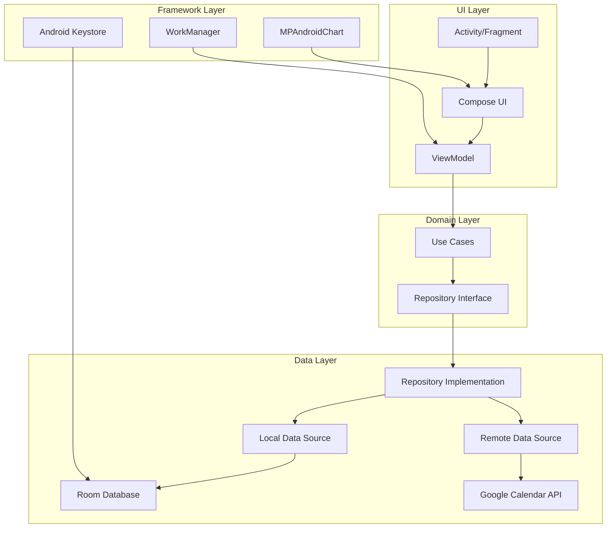

# KẾ HOẠCH PHÁT TRIỂN ỨNG DỤNG QUẢN LÝ ĐĂNG KÝ

## 1. Tổng quan dự án

### 1.1. Mục tiêu dự án

Ứng dụng quản lý đăng ký (Subscription Management) là một giải pháp nền tảng Android được phát triển bằng Kotlin, giúp người dùng quản lý các gói đăng ký đa dạng (web, ứng dụng, dịch vụ trực tuyến) với các tính năng chính:
- Quản lý thông tin đăng ký
- Hệ thống nhắc nhở thông minh khi đến hạn gia hạn
- Thống kê trực quan về chi phí đăng ký
- Phân loại tự động và tùy chỉnh danh mục
- Tính năng sao lưu/khôi phục dữ liệu

### 1.2. Phạm vi dự án

**Tính năng chính:**
- Quản lý thông tin đăng ký (thêm, sửa, xóa)
- Phân loại tự động dựa trên quy tắc (rule-based) với từ khóa định sẵn
- Hệ thống nhắc nhở thông minh với WorkManager, cho phép tùy chỉnh trước 1/3/7 ngày đến hạn
- Tích hợp với Google Calendar để đồng bộ sự kiện
- Thống kê trực quan với các loại biểu đồ (cột, tròn, đường) và tính năng dự báo đơn giản
- Tính năng sao lưu/khôi phục dữ liệu với import/export file
- Bảo mật dữ liệu với Android Keystore System và xác thực sinh trắc học

**Nền tảng:**
- Hệ điều hành: Android (API 29+)
- Ngôn ngữ: Kotlin
- Giao diện: Jetpack Compose với Material Design 3
- Cơ sở dữ liệu: Room với SQLCipher để mã hóa
- Kiến trúc: MVVM (Model-View-ViewModel) với Repository Pattern

### 1.3. Đối tượng người dùng

Ứng dụng hướng đến đối tượng người dùng cá nhân có nhu cầu quản lý các gói đăng ký dịch vụ trực tuyến như:
- Người dùng có nhiều đăng ký ứng dụng, dịch vụ web
- Người muốn theo dõi chi phí hàng tháng cho các dịch vụ
- Người cần nhắc nhở khi đến hạn gia hạn hoặc hủy dịch vụ
- Người muốn phân tích chi tiêu cho các danh mục khác nhau

## 2. Lộ trình triển khai

### 2.1. Giai đoạn 1: Thiết kế và chuẩn bị (2 tuần)
- Thiết kế wireframe cho tất cả các màn hình
- Thiết kế cơ sở dữ liệu chi tiết
- Chuẩn bị môi trường phát triển
- Thiết lập cấu trúc dự án

### 2.2. Giai đoạn 2: Phát triển core module (3 tuần)
- Triển khai cơ sở dữ liệu với Room
- Triển khai Repository và Use Cases
- Triển khai ViewModel cho các màn hình chính
- Triển khai giao diện người dùng cơ bản

### 2.3. Giai đoạn 3: Tính năng quản lý đăng ký (2 tuần)
- Triển khai thêm/sửa/xóa đăng ký
- Triển khai tính năng phân loại tự động
- Triển khai quản lý danh mục
- Triển khai tìm kiếm và lọc

### 2.4. Giai đoạn 4: Hệ thống thông báo (2 tuần)
- Triển khai WorkManager cho nhắc nhở định kỳ
- Triển khai tạo và hiển thị thông báo
- Triển khai tùy chọn nhắc nhở
- Triển khai BootReceiver

### 2.5. Giai đoạn 5: Thống kê và biểu đồ (2 tuần)
- Triển khai tính năng thống kê
- Tích hợp MPAndroidChart
- Triển khai các loại biểu đồ
- Triển khai bộ lọc và tùy chọn

### 2.6. Giai đoạn 6: Tích hợp Google Calendar (1 tuần)
- Triển khai tích hợp Google Calendar API
- Triển khai đồng bộ sự kiện
- Triển khai quản lý quyền truy cập

### 2.7. Giai đoạn 7: Sao lưu/Khôi phục dữ liệu (1 tuần)
- Triển khai xuất dữ liệu sang file
- Triển khai nhập dữ liệu từ file
- Triển khai xác thực file

### 2.8. Giai đoạn 8: Bảo mật dữ liệu (1 tuần)
- Triển khai xác thực sinh trắc học
- Triển khai mã hóa dữ liệu nhạy cảm
- Triển khai Android Keystore

### 2.9. Giai đoạn 9: Kiểm thử (2 tuần)
- Viết unit test cho các thành phần
- Viết UI test cho các màn hình
- Kiểm thử tích hợp
- Sửa lỗi và tối ưu hóa

### 2.10. Giai đoạn 10: Hoàn thiện và triển khai (1 tuần)
- Tối ưu hóa hiệu năng
- Hoàn thiện giao diện người dùng
- Chuẩn bị tài liệu
- Triển khai phiên bản đầu tiên

## 3. Chi tiết kỹ thuật

### 3.1. Kiến trúc MVVM

Ứng dụng được phát triển theo kiến trúc MVVM (Model-View-ViewModel) kết hợp với Repository Pattern để tách biệt logic nghiệp vụ và giao diện người dùng.



### 3.2. Room Database

#### 3.2.1. Entity: Subscription

```kotlin
@Entity(
    tableName = "subscriptions",
    foreignKeys = [
        ForeignKey(
            entity = Category::class,
            parentColumns = ["id"],
            childColumns = ["category_id"],
            onDelete = ForeignKey.CASCADE
        )
    ],
    indices = [
        Index(value = ["category_id"]),
        Index(value = ["next_billing_date"]),
        Index(value = ["is_active"])
    ]
)
data class Subscription(
    @PrimaryKey(autoGenerate = true) val id: Long = 0,
    @ColumnInfo(name = "name") val name: String,
    @ColumnInfo(name = "description") val description: String?,
    @ColumnInfo(name = "price") val price: Double,
    @ColumnInfo(name = "currency") val currency: String,
    @ColumnInfo(name = "billing_cycle") val billingCycle: BillingCycle,
    @ColumnInfo(name = "start_date") val startDate: Long,
    @ColumnInfo(name = "next_billing_date") val nextBillingDate: Long,
    @ColumnInfo(name = "end_date") val endDate: Long?,
    @ColumnInfo(name = "reminder_days") val reminderDays: Int,
    @ColumnInfo(name = "is_active") val isActive: Boolean,
    @ColumnInfo(name = "category_id") val categoryId: Long,
    @ColumnInfo(name = "website_url") val websiteUrl: String?,
    @ColumnInfo(name = "app_package_name") val appPackageName: String?,
    @ColumnInfo(name = "notes") val notes: String?,
    @ColumnInfo(name = "created_at") val createdAt: Long,
    @ColumnInfo(name = "updated_at") val updatedAt: Long
)

enum class BillingCycle {
    DAILY, WEEKLY, MONTHLY, YEARLY
}
```

#### 3.2.2. Entity: Category

```kotlin
@Entity(
    tableName = "categories",
    indices = [
        Index(value = ["name"], unique = true)
    ]
)
data class Category(
    @PrimaryKey(autoGenerate = true) val id: Long = 0,
    @ColumnInfo(name = "name") val name: String,
    @ColumnInfo(name = "color") val color: String,
    @ColumnInfo(name = "icon") val icon: String?,
    @ColumnInfo(name = "is_predefined") val isPredefined: Boolean,
    @ColumnInfo(name = "keywords") val keywords: String?,
    @ColumnInfo(name = "created_at") val createdAt: Long,
    @ColumnInfo(name = "updated_at") val updatedAt: Long
)
```

#### 3.2.3. Entity: Reminder

```kotlin
@Entity(
    tableName = "reminders",
    foreignKeys = [
        ForeignKey(
            entity = Subscription::class,
            parentColumns = ["id"],
            childColumns = ["subscription_id"],
            onDelete = ForeignKey.CASCADE
        )
    ],
    indices = [
        Index(value = ["subscription_id"]),
        Index(value = ["reminder_date"]),
        Index(value = ["is_notified"])
    ]
)
data class Reminder(
    @PrimaryKey(autoGenerate = true) val id: Long = 0,
    @ColumnInfo(name = "subscription_id") val subscriptionId: Long,
    @ColumnInfo(name = "reminder_date") val reminderDate: Long,
    @ColumnInfo(name = "reminder_type") val reminderType: ReminderType,
    @ColumnInfo(name = "is_notified") val isNotified: Boolean,
    @ColumnInfo(name = "notification_id") val notificationId: Int,
    @ColumnInfo(name = "created_at") val createdAt: Long,
    @ColumnInfo(name = "updated_at") val updatedAt: Long
)

enum class ReminderType {
    RENEWAL, CANCELLATION
}
```

#### 3.2.4. Entity: PaymentHistory

```kotlin
@Entity(
    tableName = "payment_history",
    foreignKeys = [
        ForeignKey(
            entity = Subscription::class,
            parentColumns = ["id"],
            childColumns = ["subscription_id"],
            onDelete = ForeignKey.CASCADE
        )
    ],
    indices = [
        Index(value = ["subscription_id"]),
        Index(value = ["payment_date"])
    ]
)
data class PaymentHistory(
    @PrimaryKey(autoGenerate = true) val id: Long = 0,
    @ColumnInfo(name = "subscription_id") val subscriptionId: Long,
    @ColumnInfo(name = "amount") val amount: Double,
    @ColumnInfo(name = "currency") val currency: String,
    @ColumnInfo(name = "payment_date") val paymentDate: Long,
    @ColumnInfo(name = "payment_method") val paymentMethod: String?,
    @ColumnInfo(name = "transaction_id") val transactionId: String?,
    @ColumnInfo(name = "notes") val notes: String?,
    @ColumnInfo(name = "created_at") val createdAt: Long,
    @ColumnInfo(name = "updated_at") val updatedAt: Long
)
```

#### 3.2.5. Database

```kotlin
@Database(
    entities = [
        Subscription::class,
        Category::class,
        Reminder::class,
        PaymentHistory::class
    ],
    version = 1,
    exportSchema = false
)
@TypeConverters(Converters::class)
abstract class AppDatabase : RoomDatabase() {
    abstract fun subscriptionDao(): SubscriptionDao
    abstract fun categoryDao(): CategoryDao
    abstract fun reminderDao(): ReminderDao
    abstract fun paymentHistoryDao(): PaymentHistoryDao
    
    companion object {
        @Volatile
        private var INSTANCE: AppDatabase? = null
        
        fun getDatabase(context: Context): AppDatabase {
            return INSTANCE ?: synchronized(this) {
                val instance = Room.databaseBuilder(
                    context.applicationContext,
                    AppDatabase::class.java,
                    "subscription_database"
                )
                .addMigrations(MIGRATION_1_2)
                .build()
                INSTANCE = instance
                instance
            }
        }
        
        private val MIGRATION_1_2 = object : Migration(1, 2) {
            override fun migrate(database: SupportSQLiteDatabase) {
                // Migration logic when upgrading database version
            }
        }
    }
}

class Converters {
    @TypeConverter
    fun fromBillingCycle(billingCycle: BillingCycle): String {
        return billingCycle.name
    }

    @TypeConverter
    fun toBillingCycle(billingCycle: String): BillingCycle {
        return BillingCycle.valueOf(billingCycle)
    }

    @TypeConverter
    fun fromReminderType(reminderType: ReminderType): String {
        return reminderType.name
    }

    @TypeConverter
    fun toReminderType(reminderType: String): ReminderType {
        return ReminderType.valueOf(reminderType)
    }
}
```

#### 3.2.6. DAOs

```kotlin
@Dao
interface SubscriptionDao {
    @Query("SELECT * FROM subscriptions ORDER BY name ASC")
    suspend fun getAllSubscriptions(): List<Subscription>

    @Query("SELECT * FROM subscriptions WHERE is_active = 1 ORDER BY next_billing_date ASC")
    suspend fun getActiveSubscriptions(): List<Subscription>

    @Query("SELECT * FROM subscriptions WHERE id = :id")
    suspend fun getSubscriptionById(id: Long): Subscription?

    @Insert(onConflict = OnConflictStrategy.REPLACE)
    suspend fun insertSubscription(subscription: Subscription): Long

    @Update
    suspend fun updateSubscription(subscription: Subscription)

    @Delete
    suspend fun deleteSubscription(subscription: Subscription)

    @Query("SELECT * FROM subscriptions WHERE category_id = :categoryId")
    suspend fun getSubscriptionsByCategory(categoryId: Long): List<Subscription>

    @Query("SELECT * FROM subscriptions WHERE next_billing_date BETWEEN :startDate AND :endDate")
    suspend fun getSubscriptionsByBillingDateRange(startDate: Long, endDate: Long): List<Subscription>

    @Query("SELECT * FROM subscriptions WHERE name LIKE '%' || :searchQuery || '%' OR description LIKE '%' || :searchQuery || '%'")
    suspend fun searchSubscriptions(searchQuery: String): List<Subscription>
}

@Dao
interface CategoryDao {
    @Query("SELECT * FROM categories ORDER BY name ASC")
    suspend fun getAllCategories(): List<Category>

    @Query("SELECT * FROM categories WHERE id = :id")
    suspend fun getCategoryById(id: Long): Category?

    @Insert(onConflict = OnConflictStrategy.REPLACE)
    suspend fun insertCategory(category: Category): Long

    @Update
    suspend fun updateCategory(category: Category)

    @Delete
    suspend fun deleteCategory(category: Category)

    @Query("SELECT * FROM categories WHERE is_predefined = 1")
    suspend fun getPredefinedCategories(): List<Category>

    @Query("SELECT * FROM categories WHERE keywords LIKE '%' || :keyword || '%'")
    suspend fun getCategoriesByKeyword(keyword: String): List<Category>
}

@Dao
interface ReminderDao {
    @Query("SELECT * FROM reminders ORDER BY reminder_date ASC")
    suspend fun getAllReminders(): List<Reminder>

    @Query("SELECT * FROM reminders WHERE id = :id")
    suspend fun getReminderById(id: Long): Reminder?

    @Insert(onConflict = OnConflictStrategy.REPLACE)
    suspend fun insertReminder(reminder: Reminder): Long

    @Update
    suspend fun updateReminder(reminder: Reminder)

    @Delete
    suspend fun deleteReminder(reminder: Reminder)

    @Query("SELECT * FROM reminders WHERE subscription_id = :subscriptionId")
    suspend fun getRemindersBySubscriptionId(subscriptionId: Long): List<Reminder>

    @Query("SELECT * FROM reminders WHERE is_notified = 0 AND reminder_date <= :currentDate")
    suspend fun getPendingReminders(currentDate: Long): List<Reminder>

    @Query("UPDATE reminders SET is_notified = 1 WHERE id = :reminderId")
    suspend fun markReminderAsNotified(reminderId: Long)
}

@Dao
interface PaymentHistoryDao {
    @Query("SELECT * FROM payment_history ORDER BY payment_date DESC")
    suspend fun getAllPaymentHistory(): List<PaymentHistory>

    @Query("SELECT * FROM payment_history WHERE id = :id")
    suspend fun getPaymentHistoryById(id: Long): PaymentHistory?

    @Insert(onConflict = OnConflictStrategy.REPLACE)
    suspend fun insertPaymentHistory(paymentHistory: PaymentHistory): Long

    @Update
    suspend fun updatePaymentHistory(paymentHistory: PaymentHistory)

    @Delete
    suspend fun deletePaymentHistory(paymentHistory: PaymentHistory)

    @Query("SELECT * FROM payment_history WHERE subscription_id = :subscriptionId")
    suspend fun getPaymentHistoryBySubscriptionId(subscriptionId: Long): List<PaymentHistory>

    @Query("SELECT * FROM payment_history WHERE payment_date BETWEEN :startDate AND :endDate")
    suspend fun getPaymentHistoryByDateRange(startDate: Long, endDate: Long): List<PaymentHistory>

    @Query("SELECT SUM(amount) FROM payment_history WHERE payment_date BETWEEN :startDate AND :endDate")
    suspend fun getTotalPaymentByDateRange(startDate: Long, endDate: Long): Double?
}
```

### 3.3. Repository Pattern

```kotlin
interface SubscriptionRepository {
    suspend fun getAllSubscriptions(): List<Subscription>
    suspend fun getActiveSubscriptions(): List<Subscription>
    suspend fun getSubscriptionById(id: Long): Subscription?
    suspend fun insertSubscription(subscription: Subscription): Long
    suspend fun updateSubscription(subscription: Subscription)
    suspend fun deleteSubscription(subscription: Subscription)
    suspend fun getSubscriptionsByCategory(categoryId: Long): List<Subscription>
    suspend fun getSubscriptionsByBillingDateRange(startDate: Long, endDate: Long): List<Subscription>
    suspend fun searchSubscriptions(searchQuery: String): List<Subscription>
}

class SubscriptionRepositoryImpl(
    private val subscriptionDao: SubscriptionDao,
    private val categoryDao: CategoryDao,
    private val reminderDao: ReminderDao,
    private val paymentHistoryDao: PaymentHistoryDao
) : SubscriptionRepository {

    override suspend fun getAllSubscriptions(): List<Subscription> {
        return subscriptionDao.getAllSubscriptions()
    }

    override suspend fun getActiveSubscriptions(): List<Subscription> {
        return subscriptionDao.getActiveSubscriptions()
    }

    override suspend fun getSubscriptionById(id: Long): Subscription? {
        return subscriptionDao.getSubscriptionById(id)
    }

    override suspend fun insertSubscription(subscription: Subscription): Long {
        val subscriptionId = subscriptionDao.insertSubscription(subscription)
        
        // Create reminders for the subscription
        val reminderDays = subscription.reminderDays
        if (reminderDays > 0) {
            val reminderDate = subscription.nextBillingDate - (reminderDays * 24 * 60 * 60 * 1000)
            val reminder = Reminder(
                subscriptionId = subscriptionId,
                reminderDate = reminderDate,
                reminderType = ReminderType.RENEWAL,
                isNotified = false,
                notificationId = generateNotificationId(),
                createdAt = System.currentTimeMillis(),
                updatedAt = System.currentTimeMillis()
            )
            reminderDao.insertReminder(reminder)
        }
        
        return subscriptionId
    }

    override suspend fun updateSubscription(subscription: Subscription) {
        subscriptionDao.updateSubscription(subscription)
        
        // Update reminders
        reminderDao.getRemindersBySubscriptionId(subscription.id).forEach { reminder ->
            val newReminderDate = subscription.nextBillingDate - (subscription.reminderDays * 24 * 60 * 60 * 1000)
            val updatedReminder = reminder.copy(
                reminderDate = newReminderDate,
                updatedAt = System.currentTimeMillis()
            )
            reminderDao.updateReminder(updatedReminder)
        }
    }

    override suspend fun deleteSubscription(subscription: Subscription) {
        // Delete related reminders and payment history
        reminderDao.getRemindersBySubscriptionId(subscription.id).forEach { reminder ->
            reminderDao.deleteReminder(reminder)
        }
        
        paymentHistoryDao.getPaymentHistoryBySubscriptionId(subscription.id).forEach { payment ->
            paymentHistoryDao.deletePaymentHistory(payment)
        }
        
        subscriptionDao.deleteSubscription(subscription)
    }

    override suspend fun getSubscriptionsByCategory(categoryId: Long): List<Subscription> {
        return subscriptionDao.getSubscriptionsByCategory(categoryId)
    }

    override suspend fun getSubscriptionsByBillingDateRange(startDate: Long, endDate: Long): List<Subscription> {
        return subscriptionDao.getSubscriptionsByBillingDateRange(startDate, endDate)
    }

    override suspend fun searchSubscriptions(searchQuery: String): List<Subscription> {
        return subscriptionDao.searchSubscriptions(searchQuery)
    }
    
    private fun generateNotificationId(): Int {
        return Random.nextInt(Int.MAX_VALUE)
    }
}
```

### 3.4. Use Cases

```kotlin
class GetActiveSubscriptionsUseCase(
    private val subscriptionRepository: SubscriptionRepository
) {
    suspend operator fun invoke(): List<Subscription> {
        return subscriptionRepository.getActiveSubscriptions()
    }
}

class GetSubscriptionByIdUseCase(
    private val subscriptionRepository: SubscriptionRepository
) {
    suspend operator fun invoke(id: Long): Subscription? {
        return subscriptionRepository.getSubscriptionById(id)
    }
}

class AddSubscriptionUseCase(
    private val subscriptionRepository: SubscriptionRepository,
    private val categoryRepository: CategoryRepository
) {
    suspend operator fun invoke(subscription: Subscription): Long {
        // Auto-categorize if no category is selected
        if (subscription.categoryId == 0L) {
            val suggestedCategoryId = suggestCategory(subscription.name, subscription.description)
            if (suggestedCategoryId != null) {
                val updatedSubscription = subscription.copy(categoryId = suggestedCategoryId)
                return subscriptionRepository.insertSubscription(updatedSubscription)
            }
        }
        return subscriptionRepository.insertSubscription(subscription)
    }
    
    private suspend fun suggestCategory(name: String, description: String?): Long? {
        val text = "$name ${description ?: ""}".lowercase()
        val categories = categoryRepository.getAllCategories()
        
        for (category in categories) {
            val keywords = category.keywords?.split(",")?.map { it.trim().lowercase() } ?: emptyList()
            if (keywords.any { text.contains(it) }) {
                return category.id
            }
        }
        
        return null
    }
}

class UpdateSubscriptionUseCase(
    private val subscriptionRepository: SubscriptionRepository
) {
    suspend operator fun invoke(subscription: Subscription) {
        subscriptionRepository.updateSubscription(subscription)
    }
}

class DeleteSubscriptionUseCase(
    private val subscriptionRepository: SubscriptionRepository
) {
    suspend operator fun invoke(subscription: Subscription) {
        subscriptionRepository.deleteSubscription(subscription)
    }
}

class GetSubscriptionsByCategoryUseCase(
    private val subscriptionRepository: SubscriptionRepository
) {
    suspend operator fun invoke(categoryId: Long): List<Subscription> {
        return subscriptionRepository.getSubscriptionsByCategory(categoryId)
    }
}

class SearchSubscriptionsUseCase(
    private val subscriptionRepository: SubscriptionRepository
) {
    suspend operator fun invoke(searchQuery: String): List<Subscription> {
        return subscriptionRepository.searchSubscriptions(searchQuery)
    }
}
```

### 3.5. ViewModels

```kotlin
class SubscriptionListViewModel(
    private val getActiveSubscriptionsUseCase: GetActiveSubscriptionsUseCase,
    private val searchSubscriptionsUseCase: SearchSubscriptionsUseCase
) : ViewModel() {
    
    private val _subscriptions = MutableStateFlow<List<Subscription>>(emptyList())
    val subscriptions: StateFlow<List<Subscription>> = _subscriptions.asStateFlow()
    
    private val _isLoading = MutableStateFlow(false)
    val isLoading: StateFlow<Boolean> = _isLoading.asStateFlow()
    
    private val _searchQuery = MutableStateFlow("")
    val searchQuery: StateFlow<String> = _searchQuery.asStateFlow()
    
    init {
        loadSubscriptions()
    }
    
    private fun loadSubscriptions() {
        viewModelScope.launch {
            _isLoading.value = true
            try {
                _subscriptions.value = getActiveSubscriptionsUseCase()
            } catch (e: Exception) {
                // Handle error
            } finally {
                _isLoading.value = false
            }
        }
    }
    
    fun searchSubscriptions(query: String) {
        _searchQuery.value = query
        viewModelScope.launch {
            _isLoading.value = true
            try {
                if (query.isBlank()) {
                    _subscriptions.value = getActiveSubscriptionsUseCase()
                } else {
                    _subscriptions.value = searchSubscriptionsUseCase(query)
                }
            } catch (e: Exception) {
                // Handle error
            } finally {
                _isLoading.value = false
            }
        }
    }
    
    fun refreshSubscriptions() {
        loadSubscriptions()
    }
}

class SubscriptionDetailViewModel(
    private val getSubscriptionByIdUseCase: GetSubscriptionByIdUseCase,
    private val updateSubscriptionUseCase: UpdateSubscriptionUseCase,
    private val deleteSubscriptionUseCase: DeleteSubscriptionUseCase,
    savedStateHandle: SavedStateHandle
) : ViewModel() {
    
    private val subscriptionId: Long = savedStateHandle.get<Long>("subscriptionId") ?: 0L
    
    private val _subscription = MutableStateFlow<Subscription?>(null)
    val subscription: StateFlow<Subscription?> = _subscription.asStateFlow()
    
    private val _isLoading = MutableStateFlow(false)
    val isLoading: StateFlow<Boolean> = _isLoading.asStateFlow()
    
    private val _isDeleted = MutableStateFlow(false)
    val isDeleted: StateFlow<Boolean> = _isDeleted.asStateFlow()
    
    init {
        loadSubscription()
    }
    
    private fun loadSubscription() {
        if (subscriptionId == 0L) return
        
        viewModelScope.launch {
            _isLoading.value = true
            try {
                _subscription.value = getSubscriptionByIdUseCase(subscriptionId)
            } catch (e: Exception) {
                // Handle error
            } finally {
                _isLoading.value = false
            }
        }
    }
    
    fun updateSubscription(subscription: Subscription) {
        viewModelScope.launch {
            _isLoading.value = true
            try {
                updateSubscriptionUseCase(subscription)
                _subscription.value = subscription
            } catch (e: Exception) {
                // Handle error
            } finally {
                _isLoading.value = false
            }
        }
    }
    
    fun deleteSubscription() {
        viewModelScope.launch {
            _isLoading.value = true
            try {
                _subscription.value?.let { subscription ->
                    deleteSubscriptionUseCase(subscription)
                    _isDeleted.value = true
                }
            } catch (e: Exception) {
                // Handle error
            } finally {
                _isLoading.value = false
            }
        }
    }
}

class AddEditSubscriptionViewModel(
    private val addSubscriptionUseCase: AddSubscriptionUseCase,
    private val updateSubscriptionUseCase: UpdateSubscriptionUseCase,
    private val categoryRepository: CategoryRepository,
    savedStateHandle: SavedStateHandle
) : ViewModel() {
    
    private val subscriptionId: Long = savedStateHandle.get<Long>("subscriptionId") ?: 0L
    
    private val _subscription = MutableStateFlow<Subscription?>(null)
    val subscription: StateFlow<Subscription?> = _subscription.asStateFlow()
    
    private val _categories = MutableStateFlow<List<Category>>(emptyList())
    val categories: StateFlow<List<Category>> = _categories.asStateFlow()
    
    private val _isLoading = MutableStateFlow(false)
    val isLoading: StateFlow<Boolean> = _isLoading.asStateFlow()
    
    private val _isSaved = MutableStateFlow(false)
    val isSaved: StateFlow<Boolean> = _isSaved.asStateFlow()
    
    init {
        loadCategories()
        if (subscriptionId != 0L) {
            loadSubscription()
        }
    }
    
    private fun loadCategories() {
        viewModelScope.launch {
            _isLoading.value = true
            try {
                _categories.value = categoryRepository.getAllCategories()
            } catch (e: Exception) {
                // Handle error
            } finally {
                _isLoading.value = false
            }
        }
    }
    
    private fun loadSubscription() {
        viewModelScope.launch {
            _isLoading.value = true
            try {
                // Load subscription from repository
                // _subscription.value = getSubscriptionByIdUseCase(subscriptionId)
            } catch (e: Exception) {
                // Handle error
            } finally {
                _isLoading.value = false
            }
        }
    }
    
    fun saveSubscription(subscription: Subscription) {
        viewModelScope.launch {
            _isLoading.value = true
            try {
                if (subscriptionId == 0L) {
                    addSubscriptionUseCase(subscription)
                } else {
                    updateSubscriptionUseCase(subscription)
                }
                _isSaved.value = true
            } catch (e: Exception) {
                // Handle error
            } finally {
                _isLoading.value = false
            }
        }
    }
}
```

## 4. Danh sách các module chính và dependencies

### 4.1. Core Dependencies

```kotlin
// build.gradle.kts (Project level)
plugins {
    alias(libs.plugins.android.application) apply false
    alias(libs.plugins.kotlin.android) apply false
    alias(libs.plugins.kotlin.compose) apply false
    alias(libs.plugins.kotlin.kapt) apply false
    alias(libs.plugins.hilt.android) apply false
}

// build.gradle.kts (App level)
plugins {
    alias(libs.plugins.android.application)
    alias(libs.plugins.kotlin.android)
    alias(libs.plugins.kotlin.compose)
    alias(libs.plugins.kotlin.kapt)
    alias(libs.plugins.hilt.android)
}

android {
    namespace = "com.example.subcriptionmanagementapp"
    compileSdk = 36

    defaultConfig {
        applicationId = "com.example.subcriptionmanagementapp"
        minSdk = 29
        targetSdk = 36
        versionCode = 1
        versionName = "1.0"

        testInstrumentationRunner = "androidx.test.runner.AndroidJUnitRunner"
    }

    buildTypes {
        release {
            isMinifyEnabled = false
            proguardFiles(
                getDefaultProguardFile("proguard-android-optimize.txt"),
                "proguard-rules.pro"
            )
        }
    }
    compileOptions {
        sourceCompatibility = JavaVersion.VERSION_11
        targetCompatibility = JavaVersion.VERSION_11
    }
    kotlinOptions {
        jvmTarget = "11"
    }
    buildFeatures {
        compose = true
    }
    composeOptions {
        kotlinCompilerExtensionVersion = "1.5.1"
    }
    packaging {
        resources {
            excludes += "/META-INF/{AL2.0,LGPL2.1}"
        }
    }
}

dependencies {
    // Core Android dependencies
    implementation(libs.androidx.core.ktx)
    implementation(libs.androidx.lifecycle.runtime.ktx)
    implementation(libs.androidx.activity.compose)
    implementation(platform(libs.androidx.compose.bom))
    implementation(libs.androidx.compose.ui)
    implementation(libs.androidx.compose.ui.graphics)
    implementation(libs.androidx.compose.ui.tooling.preview)
    implementation(libs.androidx.compose.material3)
    
    // Navigation
    implementation(libs.androidx.navigation.compose)
    implementation(libs.androidx.hilt.navigation.compose)
    
    // ViewModel and LiveData
    implementation(libs.androidx.lifecycle.viewmodel.compose)
    implementation(libs.androidx.lifecycle.runtime.compose)
    
    // Room
    implementation(libs.androidx.room.runtime)
    implementation(libs.androidx.room.ktx)
    kapt(libs.androidx.room.compiler)
    
    // Hilt for Dependency Injection
    implementation(libs.hilt.android)
    kapt(libs.hilt.compiler)
    
    // WorkManager
    implementation(libs.androidx.work.runtime.ktx)
    implementation(libs.androidx.hilt.work)
    
    // DataStore
    implementation(libs.androidx.datastore.preferences)
    
    // Biometric
    implementation(libs.androidx.biometric)
    
    // Charts
    implementation(libs.mpandroidchart)
    
    // Coroutines
    implementation(libs.kotlinx.coroutines.android)
    implementation(libs.kotlinx.coroutines.play.services)
    
    // Calendar
    implementation(libs.google.api.services.calendar)
    implementation(libs.google.api.client.android)
    implementation(libs.google.api.client.gson)
    
    // SQLCipher for encryption
    implementation(libs.zetetic.sqlcipher.android)
    implementation(libs.androidx.sqlite.ktx)
    
    // Testing
    testImplementation(libs.junit)
    testImplementation(libs.mockito.core)
    testImplementation(libs.mockito.kotlin)
    testImplementation(libs.kotlinx.coroutines.test)
    testImplementation(libs.androidx.arch.core.testing)
    
    androidTestImplementation(libs.androidx.junit)
    androidTestImplementation(libs.androidx.espresso.core)
    androidTestImplementation(libs.androidx.compose.ui.test.junit4)
    androidTestImplementation(libs.androidx.navigation.testing)
    androidTestImplementation(libs.hilt.android.testing)
    kaptAndroidTest(libs.hilt.compiler)
    
    debugImplementation(libs.androidx.compose.ui.tooling)
    debugImplementation(libs.androidx.compose.ui.test.manifest)
}
```

### 4.2. libs.versions.toml

```toml
[versions]
agp = "8.13.0"
kotlin = "2.0.21"
coreKtx = "1.10.1"
junit = "4.13.2"
junitVersion = "1.1.5"
espressoCore = "3.5.1"
lifecycleRuntimeKtx = "2.6.1"
activityCompose = "1.8.0"
composeBom = "2024.09.00"
navigationCompose = "2.7.5"
hiltNavigationCompose = "1.1.0"
hilt = "2.48"
room = "2.6.1"
workRuntime = "2.9.0"
hiltWork = "1.2.0"
datastore = "1.0.0"
biometric = "1.2.0-alpha05"
mpandroidchart = "3.1.0"
coroutines = "1.7.3"
googleCalendar = "v1-rev20220404-2.0.0"
googleApiClient = "2.2.0"
sqlcipher = "4.5.3"
sqlite = "2.4.0"
mockito = "5.4.0"
mockitoKotlin = "5.1.0"
coroutinesTest = "1.7.3"
archTesting = "2.2.0"
navigationTesting = "2.7.5"
hiltTesting = "2.48"

[libraries]
androidx-core-ktx = { group = "androidx.core", name = "core-ktx", version.ref = "coreKtx" }
junit = { group = "junit", name = "junit", version.ref = "junit" }
androidx-junit = { group = "androidx.test.ext", name = "junit", version.ref = "junitVersion" }
androidx-espresso-core = { group = "androidx.test.espresso", name = "espresso-core", version.ref = "espressoCore" }
androidx-lifecycle-runtime-ktx = { group = "androidx.lifecycle", name = "lifecycle-runtime-ktx", version.ref = "lifecycleRuntimeKtx" }
androidx-activity-compose = { group = "androidx.activity", name = "activity-compose", version.ref = "activityCompose" }
androidx-compose-bom = { group = "androidx.compose", name = "compose-bom", version.ref = "composeBom" }
androidx-compose-ui = { group = "androidx.compose.ui", name = "ui" }
androidx-compose-ui-graphics = { group = "androidx.compose.ui", name = "ui-graphics" }
androidx-compose-ui-tooling = { group = "androidx.compose.ui", name = "ui-tooling" }
androidx-compose-ui-tooling-preview = { group = "androidx.compose.ui", name = "ui-tooling-preview" }
androidx-compose-ui-test-manifest = { group = "androidx.compose.ui", name = "ui-test-manifest" }
androidx-compose-ui-test-junit4 = { group = "androidx.compose.ui", name = "ui-test-junit4" }
androidx-compose-material3 = { group = "androidx.compose.material3", name = "material3" }

# Navigation
androidx-navigation-compose = { group = "androidx.navigation", name = "navigation-compose", version.ref = "navigationCompose" }
androidx-hilt-navigation-compose = { group = "androidx.hilt", name = "hilt-navigation-compose", version.ref = "hiltNavigationCompose" }

# ViewModel and LiveData
androidx-lifecycle-viewmodel-compose = { group = "androidx.lifecycle", name = "lifecycle-viewmodel-compose", version.ref = "lifecycleRuntimeKtx" }
androidx-lifecycle-runtime-compose = { group = "androidx.lifecycle", name = "lifecycle-runtime-compose", version.ref = "lifecycleRuntimeKtx" }

# Room
androidx-room-runtime = { group = "androidx.room", name = "room-runtime", version.ref = "room" }
androidx-room-ktx = { group = "androidx.room", name = "room-ktx", version.ref = "room" }
androidx-room-compiler = { group = "androidx.room", name = "room-compiler", version.ref = "room" }

# Hilt
hilt-android = { group = "com.google.dagger", name = "hilt-android", version.ref = "hilt" }
hilt-compiler = { group = "com.google.dagger", name = "hilt-compiler", version.ref = "hilt" }

# WorkManager
androidx-work-runtime-ktx = { group = "androidx.work", name = "work-runtime-ktx", version.ref = "workRuntime" }
androidx-hilt-work = { group = "androidx.hilt", name = "hilt-work", version.ref = "hiltWork" }

# DataStore
androidx-datastore-preferences = { group = "androidx.datastore", name = "datastore-preferences", version.ref = "datastore" }

# Biometric
androidx-biometric = { group = "androidx.biometric", name = "biometric", version.ref = "biometric" }

# Charts
mpandroidchart = { group = "com.github.PhilJay", name = "MPAndroidChart", version.ref = "mpandroidchart" }

# Coroutines
kotlinx-coroutines-android = { group = "org.jetbrains.kotlinx", name = "kotlinx-coroutines-android", version.ref = "coroutines" }
kotlinx-coroutines-play-services = { group = "org.jetbrains.kotlinx", name = "kotlinx-coroutines-play-services", version.ref = "coroutines" }

# Calendar
google-api-services-calendar = { group = "com.google.apis", name = "google-api-services-calendar", version.ref = "googleCalendar" }
google-api-client-android = { group = "com.google.api-client", name = "google-api-client-android", version.ref = "googleApiClient" }
google-api-client-gson = { group = "com.google.api-client", name = "google-api-client-gson", version.ref = "googleApiClient" }

# SQLCipher
zetetic-sqlcipher-android = { group = "net.zetetic", name = "sqlcipher-android", version.ref = "sqlcipher" }
androidx-sqlite-ktx = { group = "androidx.sqlite", name = "sqlite-ktx", version.ref = "sqlite" }

# Testing
mockito-core = { group = "org.mockito", name = "mockito-core", version.ref = "mockito" }
mockito-kotlin = { group = "org.mockito.kotlin", name = "mockito-kotlin", version.ref = "mockitoKotlin" }
kotlinx-coroutines-test = { group = "org.jetbrains.kotlinx", name = "kotlinx-coroutines-test", version.ref = "coroutinesTest" }
androidx-arch-core-testing = { group = "androidx.arch.core", name = "core-testing", version.ref = "archTesting" }
androidx-navigation-testing = { group = "androidx.navigation", name = "navigation-testing", version.ref = "navigationTesting" }
hilt-android-testing = { group = "com.google.dagger", name = "hilt-android-testing", version.ref = "hiltTesting" }

[plugins]
android-application = { id = "com.android.application", version.ref = "agp" }
kotlin-android = { id = "org.jetbrains.kotlin.android", version.ref = "kotlin" }
kotlin-compose = { id = "org.jetbrains.kotlin.plugin.compose", version.ref = "kotlin" }
kotlin-kapt = { id = "org.jetbrains.kotlin.kapt", version.ref = "kotlin" }
hilt-android = { id = "com.google.dagger.hilt.android", version.ref = "hilt" }
```

### 4.3. Module Structure

```
app/
├── src/
│   ├── main/
│   │   ├── java/
│   │   │   └── com/example/subcriptionmanagementapp/
│   │   │       ├── data/
│   │   │       │   ├── local/
│   │   │       │   │   ├── dao/
│   │   │       │   │   │   ├── CategoryDao.kt
│   │   │       │   │   │   ├── PaymentHistoryDao.kt
│   │   │       │   │   │   ├── ReminderDao.kt
│   │   │       │   │   │   └── SubscriptionDao.kt
│   │   │       │   │   ├── entity/
│   │   │       │   │   │   ├── Category.kt
│   │   │       │   │   │   ├── PaymentHistory.kt
│   │   │       │   │   │   ├── Reminder.kt
│   │   │       │   │   │   └── Subscription.kt
│   │   │       │   │   └── AppDatabase.kt
│   │   │       │   ├── repository/
│   │   │       │   │   ├── CategoryRepository.kt
│   │   │       │   │   ├── CategoryRepositoryImpl.kt
│   │   │       │   │   ├── PaymentHistoryRepository.kt
│   │   │       │   │   ├── PaymentHistoryRepositoryImpl.kt
│   │   │       │   │   ├── ReminderRepository.kt
│   │   │       │   │   ├── ReminderRepositoryImpl.kt
│   │   │       │   │   ├── SubscriptionRepository.kt
│   │   │       │   │   └── SubscriptionRepositoryImpl.kt
│   │   │       │   └── remote/
│   │   │       │       └── GoogleCalendarService.kt
│   │   │       ├── domain/
│   │   │       │   ├── model/
│   │   │       │   │   ├── BillingCycle.kt
│   │   │       │   │   ├── ReminderType.kt
│   │   │       │   │   └── SubscriptionWithCategory.kt
│   │   │       │   └── usecase/
│   │   │       │       ├── category/
│   │   │       │       │   ├── AddCategoryUseCase.kt
│   │   │       │       │   ├── DeleteCategoryUseCase.kt
│   │   │       │       │   ├── GetAllCategoriesUseCase.kt
│   │   │       │       │   ├── GetCategoryByIdUseCase.kt
│   │   │       │       │   ├── GetPredefinedCategoriesUseCase.kt
│   │   │       │       │   └── UpdateCategoryUseCase.kt
│   │   │       │       ├── payment/
│   │   │       │       │   ├── AddPaymentHistoryUseCase.kt
│   │   │       │       │   ├── DeletePaymentHistoryUseCase.kt
│   │   │       │       │   ├── GetAllPaymentHistoryUseCase.kt
│   │   │       │       │   ├── GetPaymentHistoryByIdUseCase.kt
│   │   │       │       │   ├── GetPaymentHistoryBySubscriptionIdUseCase.kt
│   │   │       │       │   ├── GetPaymentHistoryByDateRangeUseCase.kt
│   │   │       │       │   ├── GetTotalPaymentByDateRangeUseCase.kt
│   │   │       │       │   └── UpdatePaymentHistoryUseCase.kt
│   │   │       │       ├── reminder/
│   │   │       │       │   ├── AddReminderUseCase.kt
│   │   │       │       │   ├── DeleteReminderUseCase.kt
│   │   │       │       │   ├── GetAllRemindersUseCase.kt
│   │   │       │       │   ├── GetPendingRemindersUseCase.kt
│   │   │       │       │   ├── GetReminderByIdUseCase.kt
│   │   │       │       │   ├── GetRemindersBySubscriptionIdUseCase.kt
│   │   │       │       │   ├── MarkReminderAsNotifiedUseCase.kt
│   │   │       │       │   └── UpdateReminderUseCase.kt
│   │   │       │       └── subscription/
│   │   │       │           ├── AddSubscriptionUseCase.kt
│   │   │       │           ├── DeleteSubscriptionUseCase.kt
│   │   │       │           ├── GetActiveSubscriptionsUseCase.kt
│   │   │       │           ├── GetSubscriptionByIdUseCase.kt
│   │   │       │           ├── GetSubscriptionsByBillingDateRangeUseCase.kt
│   │   │       │           ├── GetSubscriptionsByCategoryUseCase.kt
│   │   │       │           ├── SearchSubscriptionsUseCase.kt
│   │   │       │           └── UpdateSubscriptionUseCase.kt
│   │   │       ├── di/
│   │   │       │   ├── AppModule.kt
│   │   │       │   ├── DatabaseModule.kt
│   │   │       │   ├── RepositoryModule.kt
│   │   │       │   ├── UseCaseModule.kt
│   │   │       │   └── ViewModelModule.kt
│   │   │       ├── ui/
│   │   │       │   ├── components/
│   │   │       │   │   ├── charts/
│   │   │       │   │   │   ├── BarChartComponent.kt
│   │   │       │   │   │   ├── LineChartComponent.kt
│   │   │       │   │   │   └── PieChartComponent.kt
│   │   │       │   │   ├── common/
│   │   │       │   │   │   ├── LoadingIndicator.kt
│   │   │       │   │   │   ├── ErrorScreen.kt
│   │   │       │   │   │   ├── EmptyScreen.kt
│   │   │       │   │   │   ├── SearchBar.kt
│   │   │       │   │   │   └── SubscriptionCard.kt
│   │   │       │   │   ├── navigation/
│   │   │       │   │   │   ├── AppNavigation.kt
│   │   │       │   │   │   └── BottomNavigationBar.kt
│   │   │       │   │   └── settings/
│   │   │       │   │       ├── BackupRestoreSection.kt
│   │   │       │   │       ├── SecuritySection.kt
│   │   │       │   │       └── NotificationSection.kt
│   │   │       │   ├── screens/
│   │   │       │   │   ├── add_edit_subscription/
│   │   │       │   │   │   ├── AddEditSubscriptionScreen.kt
│   │   │       │   │   │   └── AddEditSubscriptionViewModel.kt
│   │   │       │   │   ├── categories/
│   │   │       │   │   │   ├── CategoriesScreen.kt
│   │   │       │   │   │   └── CategoriesViewModel.kt
│   │   │       │   │   ├── home/
│   │   │       │   │   │   ├── HomeScreen.kt
│   │   │       │   │   │   └── HomeViewModel.kt
│   │   │       │   │   ├── settings/
│   │   │       │   │   │   ├── SettingsScreen.kt
│   │   │       │   │   │   └── SettingsViewModel.kt
│   │   │       │   │   ├── statistics/
│   │   │       │   │   │   ├── StatisticsScreen.kt
│   │   │       │   │   │   └── StatisticsViewModel.kt
│   │   │       │   │   └── subscription_detail/
│   │   │       │   │       ├── SubscriptionDetailScreen.kt
│   │   │       │   │       └── SubscriptionDetailViewModel.kt
│   │   │       │   └── theme/
│   │   │       │       ├── Color.kt
│   │   │       │       ├── Theme.kt
│   │   │       │       └── Type.kt
│   │   │       ├── util/
│   │   │       │   ├── backup/
│   │   │       │   │   ├── BackupManager.kt
│   │   │       │   │   ├── ExportImportUtil.kt
│   │   │       │   │   └── FileValidator.kt
│   │   │       │   ├── biometric/
│   │   │       │   │   └── BiometricAuthManager.kt
│   │   │       │   ├── calendar/
│   │   │       │   │   ├── CalendarIntegration.kt
│   │   │       │   │   ├── CalendarPermissionManager.kt
│   │   │       │   │   └── CalendarSyncService.kt
│   │   │       │   ├── chart/
│   │   │       │   │   ├── ChartHelper.kt
│   │   │       │   │   └── StatisticsRepository.kt
│   │   │       │   ├── classification/
│   │   │       │   │   ├── CategoryClassifier.kt
│   │   │       │   │   ├── KeywordManager.kt
│   │   │       │   │   └── UserCategoryManager.kt
│   │   │       │   ├── encryption/
│   │   │       │   │   ├── AndroidKeystoreManager.kt
│   │   │       │   │   ├── DataEncryptionUtil.kt
│   │   │       │   │   └── SecurePreferences.kt
│   │   │       │   ├── notification/
│   │   │       │   │   ├── BootReceiver.kt
│   │   │       │   │   ├── NotificationHelper.kt
│   │   │       │   │   ├── ReminderScheduler.kt
│   │   │       │   │   └── ReminderWorker.kt
│   │   │       │   └── DateUtils.kt
│   │   │       ├── Application.kt
│   │   │       └── MainActivity.kt
│   │   ├── res/
│   │   │   ├── drawable/
│   │   │   │   ├── ic_launcher_background.xml
│   │   │   │   ├── ic_launcher_foreground.xml
│   │   │   │   └── ic_category_*.xml
│   │   │   ├── mipmap-*/
│   │   │   │   └── ic_launcher*.png
│   │   │   ├── values/
│   │   │   │   ├── colors.xml
│   │   │   │   ├── strings.xml
│   │   │   │   ├── themes.xml
│   │   │   │   └── dimens.xml
│   │   │   ├── xml/
│   │   │   │   ├── backup_rules.xml
│   │   │   │   ├── data_extraction_rules.xml
│   │   │   │   └── network_security_config.xml
│   │   └── AndroidManifest.xml
│   ├── test/
│   │   └── java/
│   │       └── com/example/subcriptionmanagementapp/
│   │           ├── data/
│   │           │   ├── dao/
│   │           │   │   ├── CategoryDaoTest.kt
│   │           │   │   ├── PaymentHistoryDaoTest.kt
│   │           │   │   ├── ReminderDaoTest.kt
│   │           │   │   └── SubscriptionDaoTest.kt
│   │           │   └── repository/
│   │           │       ├── CategoryRepositoryImplTest.kt
│   │           │       ├── PaymentHistoryRepositoryImplTest.kt
│   │           │       ├── ReminderRepositoryImplTest.kt
│   │           │       └── SubscriptionRepositoryImplTest.kt
│   │           ├── domain/
│   │           │   └── usecase/
│   │           │       ├── category/
│   │           │       │   ├── AddCategoryUseCaseTest.kt
│   │           │       │   ├── DeleteCategoryUseCaseTest.kt
│   │           │       │   ├── GetAllCategoriesUseCaseTest.kt
│   │           │       │   ├── GetCategoryByIdUseCaseTest.kt
│   │           │       │   ├── GetPredefinedCategoriesUseCaseTest.kt
│   │           │       │   └── UpdateCategoryUseCaseTest.kt
│   │           │       ├── payment/
│   │           │       │   ├── AddPaymentHistoryUseCaseTest.kt
│   │           │       │   ├── DeletePaymentHistoryUseCaseTest.kt
│   │           │       │   ├── GetAllPaymentHistoryUseCaseTest.kt
│   │           │       │   ├── GetPaymentHistoryByIdUseCaseTest.kt
│   │           │       │   ├── GetPaymentHistoryBySubscriptionIdUseCaseTest.kt
│   │           │       │   ├── GetPaymentHistoryByDateRangeUseCaseTest.kt
│   │           │       │   ├── GetTotalPaymentByDateRangeUseCaseTest.kt
│   │           │       │   └── UpdatePaymentHistoryUseCaseTest.kt
│   │           │       ├── reminder/
│   │           │       │   ├── AddReminderUseCaseTest.kt
│   │           │       │   ├── DeleteReminderUseCaseTest.kt
│   │           │       │   ├── GetAllRemindersUseCaseTest.kt
│   │           │       │   ├── GetPendingRemindersUseCaseTest.kt
│   │           │       │   ├── GetReminderByIdUseCaseTest.kt
│   │           │       │   ├── GetRemindersBySubscriptionIdUseCaseTest.kt
│   │           │       │   ├── MarkReminderAsNotifiedUseCaseTest.kt
│   │           │       │   └── UpdateReminderUseCaseTest.kt
│   │           │       └── subscription/
│   │           │           ├── AddSubscriptionUseCaseTest.kt
│   │           │           ├── DeleteSubscriptionUseCaseTest.kt
│   │           │           ├── GetActiveSubscriptionsUseCaseTest.kt
│   │           │           ├── GetSubscriptionByIdUseCaseTest.kt
│   │           │           ├── GetSubscriptionsByBillingDateRangeUseCaseTest.kt
│   │           │           ├── GetSubscriptionsByCategoryUseCaseTest.kt
│   │           │           ├── SearchSubscriptionsUseCaseTest.kt
│   │           │           └── UpdateSubscriptionUseCaseTest.kt
│   │           ├── util/
│   │           │   ├── backup/
│   │           │   │   ├── BackupManagerTest.kt
│   │           │   │   ├── ExportImportUtilTest.kt
│   │           │   │   └── FileValidatorTest.kt
│   │           │   ├── biometric/
│   │           │   │   └── BiometricAuthManagerTest.kt
│   │           │   ├── calendar/
│   │           │   │   ├── CalendarIntegrationTest.kt
│   │           │   │   ├── CalendarPermissionManagerTest.kt
│   │           │   │   └── CalendarSyncServiceTest.kt
│   │           │   ├── chart/
│   │           │   │   ├── ChartHelperTest.kt
│   │           │   │   └── StatisticsRepositoryTest.kt
│   │           │   ├── classification/
│   │           │   │   ├── CategoryClassifierTest.kt
│   │           │   │   ├── KeywordManagerTest.kt
│   │           │   │   └── UserCategoryManagerTest.kt
│   │           │   ├── encryption/
│   │           │   │   ├── AndroidKeystoreManagerTest.kt
│   │           │   │   ├── DataEncryptionUtilTest.kt
│   │           │   │   └── SecurePreferencesTest.kt
│   │           │   ├── notification/
│   │           │   │   ├── BootReceiverTest.kt
│   │           │   │   ├── NotificationHelperTest.kt
│   │           │   │   ├── ReminderSchedulerTest.kt
│   │           │   │   └── ReminderWorkerTest.kt
│   │           │   └── DateUtilsTest.kt
│   │           └── ExampleUnitTest.kt
│   └── androidTest/
│       └── java/
│           └── com/example/subcriptionmanagementapp/
│               ├── ui/
│               │   ├── screens/
│               │   │   ├── add_edit_subscription/
│               │   │   │   └── AddEditSubscriptionScreenTest.kt
│               │   │   ├── categories/
│               │   │   │   └── CategoriesScreenTest.kt
│               │   │   ├── home/
│               │   │   │   └── HomeScreenTest.kt
│               │   │   ├── settings/
│               │   │   │   └── SettingsScreenTest.kt
│               │   │   ├── statistics/
│               │   │   │   └── StatisticsScreenTest.kt
│               │   │   └── subscription_detail/
│               │   │       └── SubscriptionDetailScreenTest.kt
│               │   └── ExampleInstrumentedTest.kt
├── build.gradle.kts
└── proguard-rules.pro
```

## 5. Quy trình kiểm thử và tiêu chí đánh giá chất lượng

### 5.1. Unit Testing

```kotlin
// Example Unit Test for SubscriptionRepositoryImpl
class SubscriptionRepositoryImplTest {
    private lateinit var subscriptionDao: SubscriptionDao
    private lateinit var categoryDao: CategoryDao
    private lateinit var reminderDao: ReminderDao
    private lateinit var paymentHistoryDao: PaymentHistoryDao
    private lateinit var subscriptionRepository: SubscriptionRepositoryImpl

    @Before
    fun setup() {
        subscriptionDao = mockk()
        categoryDao = mockk()
        reminderDao = mockk()
        paymentHistoryDao = mockk()
        subscriptionRepository = SubscriptionRepositoryImpl(
            subscriptionDao,
            categoryDao,
            reminderDao,
            paymentHistoryDao
        )
    }

    @Test
    fun `getActiveSubscriptions should return active subscriptions from DAO`() = runBlocking {
        // Given
        val expectedSubscriptions = listOf(
            Subscription(
                name = "Netflix",
                price = 15.99,
                currency = "USD",
                billingCycle = BillingCycle.MONTHLY,
                startDate = System.currentTimeMillis(),
                nextBillingDate = System.currentTimeMillis() + 30 * 24 * 60 * 60 * 1000,
                reminderDays = 3,
                isActive = true,
                categoryId = 1L,
                createdAt = System.currentTimeMillis(),
                updatedAt = System.currentTimeMillis()
            )
        )
        coEvery { subscriptionDao.getActiveSubscriptions() } returns expectedSubscriptions

        // When
        val result = subscriptionRepository.getActiveSubscriptions()

        // Then
        assertEquals(expectedSubscriptions, result)
        coVerify { subscriptionDao.getActiveSubscriptions() }
    }

    @Test
    fun `insertSubscription should create reminder and return subscription ID`() = runBlocking {
        // Given
        val subscription = Subscription(
            name = "Spotify",
            price = 9.99,
            currency = "USD",
            billingCycle = BillingCycle.MONTHLY,
            startDate = System.currentTimeMillis(),
            nextBillingDate = System.currentTimeMillis() + 30 * 24 * 60 * 60 * 1000,
            reminderDays = 7,
            isActive = true,
            categoryId = 1L,
            createdAt = System.currentTimeMillis(),
            updatedAt = System.currentTimeMillis()
        )
        val subscriptionId = 1L
        coEvery { subscriptionDao.insertSubscription(subscription) } returns subscriptionId
        coEvery { reminderDao.insertReminder(any()) } returns 1L

        // When
        val result = subscriptionRepository.insertSubscription(subscription)

        // Then
        assertEquals(subscriptionId, result)
        coVerify { subscriptionDao.insertSubscription(subscription) }
        coVerify { reminderDao.insertReminder(any()) }
    }

    @Test
    fun `deleteSubscription should delete subscription and related data`() = runBlocking {
        // Given
        val subscription = Subscription(
            id = 1L,
            name = "YouTube Premium",
            price = 11.99,
            currency = "USD",
            billingCycle = BillingCycle.MONTHLY,
            startDate = System.currentTimeMillis(),
            nextBillingDate = System.currentTimeMillis() + 30 * 24 * 60 * 60 * 1000,
            reminderDays = 3,
            isActive = true,
            categoryId = 1L,
            createdAt = System.currentTimeMillis(),
            updatedAt = System.currentTimeMillis()
        )
        val reminders = listOf(
            Reminder(
                id = 1L,
                subscriptionId = 1L,
                reminderDate = System.currentTimeMillis(),
                reminderType = ReminderType.RENEWAL,
                isNotified = false,
                notificationId = 123,
                createdAt = System.currentTimeMillis(),
                updatedAt = System.currentTimeMillis()
            )
        )
        val paymentHistory = listOf(
            PaymentHistory(
                id = 1L,
                subscriptionId = 1L,
                amount = 11.99,
                currency = "USD",
                paymentDate = System.currentTimeMillis(),
                createdAt = System.currentTimeMillis(),
                updatedAt = System.currentTimeMillis()
            )
        )
        coEvery { reminderDao.getRemindersBySubscriptionId(subscription.id) } returns reminders
        coEvery { paymentHistoryDao.getPaymentHistoryBySubscriptionId(subscription.id) } returns paymentHistory
        coEvery { reminderDao.deleteReminder(any()) } returns Unit
        coEvery { paymentHistoryDao.deletePaymentHistory(any()) } returns Unit
        coEvery { subscriptionDao.deleteSubscription(subscription) } returns Unit

        // When
        subscriptionRepository.deleteSubscription(subscription)

        // Then
        coVerify { reminderDao.getRemindersBySubscriptionId(subscription.id) }
        coVerify { paymentHistoryDao.getPaymentHistoryBySubscriptionId(subscription.id) }
        coVerify { reminderDao.deleteReminder(reminders[0]) }
        coVerify { paymentHistoryDao.deletePaymentHistory(paymentHistory[0]) }
        coVerify { subscriptionDao.deleteSubscription(subscription) }
    }
}
```

### 5.2. UI Testing

```kotlin
// Example UI Test for HomeScreen
@RunWith(AndroidJUnit4::class)
class HomeScreenTest {
    @get:Rule
    val composeTestRule = createAndroidComposeRule<MainActivity>()

    @Before
    fun setup() {
        // Set up mock data
        val mockSubscriptions = listOf(
            Subscription(
                id = 1L,
                name = "Netflix",
                price = 15.99,
                currency = "USD",
                billingCycle = BillingCycle.MONTHLY,
                startDate = System.currentTimeMillis(),
                nextBillingDate = System.currentTimeMillis() + 30 * 24 * 60 * 60 * 1000,
                reminderDays = 3,
                isActive = true,
                categoryId = 1L,
                createdAt = System.currentTimeMillis(),
                updatedAt = System.currentTimeMillis()
            ),
            Subscription(
                id = 2L,
                name = "Spotify",
                price = 9.99,
                currency = "USD",
                billingCycle = BillingCycle.MONTHLY,
                startDate = System.currentTimeMillis(),
                nextBillingDate = System.currentTimeMillis() + 30 * 24 * 60 * 60 * 1000,
                reminderDays = 7,
                isActive = true,
                categoryId = 2L,
                createdAt = System.currentTimeMillis(),
                updatedAt = System.currentTimeMillis()
            )
        )
        
        // Set up mock ViewModel
        val mockViewModel = mockk<HomeViewModel>()
        every { mockViewModel.subscriptions } returns MutableStateFlow(mockSubscriptions).asStateFlow()
        every { mockViewModel.isLoading } returns MutableStateFlow(false).asStateFlow()
        
        // Set up Hilt
        hiltRule.inject()
    }

    @Test
    fun homeScreen_displaysSubscriptions() {
        // When
        composeTestRule.setContent {
            SubscriptionManagementAppTheme {
                HomeScreen(
                    viewModel = mockViewModel,
                    onNavigateToSubscriptionDetail = {},
                    onNavigateToAddSubscription = {},
                    onNavigateToStatistics = {},
                    onNavigateToCategories = {},
                    onNavigateToSettings = {}
                )
            }
        }

        // Then
        composeTestRule.onNodeWithText("Netflix").assertIsDisplayed()
        composeTestRule.onNodeWithText("$15.99 USD").assertIsDisplayed()
        composeTestRule.onNodeWithText("Spotify").assertIsDisplayed()
        composeTestRule.onNodeWithText("$9.99 USD").assertIsDisplayed()
    }

    @Test
    fun homeScreen_whenAddButtonClicked_navigatesToAddSubscription() {
        // Given
        var navigateToAddSubscriptionCalled = false
        
        composeTestRule.setContent {
            SubscriptionManagementAppTheme {
                HomeScreen(
                    viewModel = mockViewModel,
                    onNavigateToSubscriptionDetail = {},
                    onNavigateToAddSubscription = { navigateToAddSubscriptionCalled = true },
                    onNavigateToStatistics = {},
                    onNavigateToCategories = {},
                    onNavigateToSettings = {}
                )
            }
        }

        // When
        composeTestRule.onNodeWithContentDescription("Add subscription").performClick()

        // Then
        assertTrue(navigateToAddSubscriptionCalled)
    }

    @Test
    fun homeScreen_whenSubscriptionClicked_navigatesToDetail() {
        // Given
        var navigateToDetailCalled = false
        var subscriptionId = 0L
        
        composeTestRule.setContent {
            SubscriptionManagementAppTheme {
                HomeScreen(
                    viewModel = mockViewModel,
                    onNavigateToSubscriptionDetail = { id ->
                        navigateToDetailCalled = true
                        subscriptionId = id
                    },
                    onNavigateToAddSubscription = {},
                    onNavigateToStatistics = {},
                    onNavigateToCategories = {},
                    onNavigateToSettings = {}
                )
            }
        }

        // When
        composeTestRule.onNodeWithText("Netflix").performClick()

        // Then
        assertTrue(navigateToDetailCalled)
        assertEquals(1L, subscriptionId)
    }

    @Test
    fun homeScreen_whenSearchQueryEntered_filtersSubscriptions() {
        // Given
        val mockViewModel = mockk<HomeViewModel>()
        val filteredSubscriptions = listOf(
            Subscription(
                id = 1L,
                name = "Netflix",
                price = 15.99,
                currency = "USD",
                billingCycle = BillingCycle.MONTHLY,
                startDate = System.currentTimeMillis(),
                nextBillingDate = System.currentTimeMillis() + 30 * 24 * 60 * 60 * 1000,
                reminderDays = 3,
                isActive = true,
                categoryId = 1L,
                createdAt = System.currentTimeMillis(),
                updatedAt = System.currentTimeMillis()
            )
        )
        every { mockViewModel.subscriptions } returns MutableStateFlow(filteredSubscriptions).asStateFlow()
        every { mockViewModel.isLoading } returns MutableStateFlow(false).asStateFlow()
        every { mockViewModel.searchSubscriptions(any()) } just runs
        
        composeTestRule.setContent {
            SubscriptionManagementAppTheme {
                HomeScreen(
                    viewModel = mockViewModel,
                    onNavigateToSubscriptionDetail = {},
                    onNavigateToAddSubscription = {},
                    onNavigateToStatistics = {},
                    onNavigateToCategories = {},
                    onNavigateToSettings = {}
                )
            }
        }

        // When
        composeTestRule.onNodeWithContentDescription("Search").performClick()
        composeTestRule.onNode(isTextInput()).performTextInput("Netflix")

        // Then
        verify { mockViewModel.searchSubscriptions("Netflix") }
        composeTestRule.onNodeWithText("Netflix").assertIsDisplayed()
        composeTestRule.onNodeWithText("Spotify").assertDoesNotExist()
    }
}
```

### 5.3. Integration Testing

```kotlin
// Example Integration Test for Subscription Flow
@RunWith(AndroidJUnit4::class)
@HiltAndroidTest
class SubscriptionFlowTest {
    @get:Rule
    var hiltRule = HiltAndroidRule(this)

    @get:Rule
    var composeTestRule = createAndroidComposeRule<MainActivity>()

    @Inject
    lateinit var subscriptionRepository: SubscriptionRepository

    @Inject
    lateinit var categoryRepository: CategoryRepository

    @Before
    fun init() {
        hiltRule.inject()
    }

    @Test
    fun addSubscriptionFlow_addsSubscriptionToDatabase() {
        // Given
        val category = Category(
            name = "Entertainment",
            color = "#FF5722",
            isPredefined = true,
            keywords = "netflix,spotify,youtube",
            createdAt = System.currentTimeMillis(),
            updatedAt = System.currentTimeMillis()
        )
        runBlocking {
            categoryRepository.insertCategory(category)
        }

        // When
        composeTestRule.setContent {
            SubscriptionManagementAppTheme {
                AppNavigation()
            }
        }

        // Navigate to add subscription screen
        composeTestRule.onNodeWithContentDescription("Add subscription").performClick()

        // Fill in subscription details
        composeTestRule.onNodeWithText("Name").performTextInput("Netflix")
        composeTestRule.onNodeWithText("Price").performTextInput("15.99")
        composeTestRule.onNodeWithText("Currency").performTextInput("USD")
        composeTestRule.onNodeWithText("Billing Cycle").performClick()
        composeTestRule.onNodeWithText("Monthly").performClick()
        composeTestRule.onNodeWithText("Reminder Days").performTextInput("3")
        composeTestRule.onNodeWithText("Category").performClick()
        composeTestRule.onNodeWithText("Entertainment").performClick()
        composeTestRule.onNodeWithText("Save").performClick()

        // Then
        runBlocking {
            val subscriptions = subscriptionRepository.getActiveSubscriptions()
            assertEquals(1, subscriptions.size)
            assertEquals("Netflix", subscriptions[0].name)
            assertEquals(15.99, subscriptions[0].price)
            assertEquals("USD", subscriptions[0].currency)
            assertEquals(BillingCycle.MONTHLY, subscriptions[0].billingCycle)
            assertEquals(3, subscriptions[0].reminderDays)
        }
    }

    @Test
    fun subscriptionDetailFlow_updatesSubscription() {
        // Given
        val category = Category(
            name = "Entertainment",
            color = "#FF5722",
            isPredefined = true,
            keywords = "netflix,spotify,youtube",
            createdAt = System.currentTimeMillis(),
            updatedAt = System.currentTimeMillis()
        )
        val subscription = Subscription(
            name = "Netflix",
            price = 15.99,
            currency = "USD",
            billingCycle = BillingCycle.MONTHLY,
            startDate = System.currentTimeMillis(),
            nextBillingDate = System.currentTimeMillis() + 30 * 24 * 60 * 60 * 1000,
            reminderDays = 3,
            isActive = true,
            categoryId = 1L,
            createdAt = System.currentTimeMillis(),
            updatedAt = System.currentTimeMillis()
        )
        runBlocking {
            val categoryId = categoryRepository.insertCategory(category)
            val subscriptionId = subscriptionRepository.insertSubscription(subscription.copy(categoryId = categoryId))
        }

        // When
        composeTestRule.setContent {
            SubscriptionManagementAppTheme {
                AppNavigation()
            }
        }

        // Navigate to subscription detail
        composeTestRule.onNodeWithText("Netflix").performClick()

        // Update subscription details
        composeTestRule.onNodeWithContentDescription("Edit").performClick()
        composeTestRule.onNodeWithText("Price").performTextReplacement("12.99")
        composeTestRule.onNodeWithText("Save").performClick()

        // Then
        runBlocking {
            val subscriptions = subscriptionRepository.getActiveSubscriptions()
            assertEquals(1, subscriptions.size)
            assertEquals("Netflix", subscriptions[0].name)
            assertEquals(12.99, subscriptions[0].price)
        }
    }
}
```

### 5.4. Tiêu chí đánh giá chất lượng

#### 5.4.1. Tiêu chí mã nguồn
- **Code Coverage**: Tối thiểu 80% cho các lớp business logic và repository
- **Code Style**: Tuân thủ Kotlin Coding Conventions
- **Complexity**: Độ phức tạp cyclomatic không quá 10 cho mỗi phương thức
- **Documentation**: Tất cả các lớp public và phương thức phải có KDoc
- **Null Safety**: Sử dụng Kotlin null safety một cách phù hợp

#### 5.4.2. Tiêu chí hiệu năng
- **Startup Time**: Ứng dụng khởi động trong vòng 3 giây
- **UI Response**: Thời gian phản hồi UI không quá 200ms
- **Database Query**: Truy vấn cơ sở dữ liệu không quá 100ms
- **Memory Usage**: Sử dụng bộ nhớ không quá 150MB
- **Battery Usage**: Tối ưu hóa để giảm tiêu thụ pin

#### 5.4.3. Tiêu chí bảo mật
- **Data Encryption**: Tất cả dữ liệu nhạy cảm phải được mã hóa
- **Authentication**: Xác thực sinh trắc học để truy cập ứng dụng
- **Network Security**: Sử dụng HTTPS cho tất cả các kết nối mạng
- **Permission**: Chỉ yêu cầu quyền cần thiết
- **Data Storage**: Không lưu trữ thông tin nhạy cảm trong SharedPreferences

#### 5.4.4. Tiêu chí trải nghiệm người dùng
- **Usability**: Giao diện trực quan, dễ sử dụng
- **Accessibility**: Hỗ trợ accessibility features
- **Localization**: Hỗ trợ đa ngôn ngữ
- **Error Handling**: Xử lý lỗi một cách thân thiện với người dùng
- **Feedback**: Cung cấp phản hồi cho mọi hành động của người dùng

## 6. Kế hoạch triển khai bảo mật và xử lý dữ liệu nhạy cảm

### 6.1. Mã hóa dữ liệu với SQLCipher

```kotlin
class SecureDatabaseHelper(private val context: Context) {
    
    fun getEncryptedDatabase(): AppDatabase {
        val passphrase = getOrCreateDatabasePassphrase()
        val factory = SupportFactory(passphrase.toByteArray())
        
        return Room.databaseBuilder(
            context,
            AppDatabase::class.java,
            "encrypted_subscription_database"
        )
        .openHelperFactory(factory)
        .build()
    }
    
    private fun getOrCreateDatabasePassphrase(): String {
        val sharedPreferences = context.getSharedPreferences("secure_prefs", Context.MODE_PRIVATE)
        val keyAlias = "database_passphrase"
        
        return sharedPreferences.getString(keyAlias, null) ?: generateAndStorePassphrase(sharedPreferences, keyAlias)
    }
    
    private fun generateAndStorePassphrase(sharedPreferences: SharedPreferences, keyAlias: String): String {
        val keyGenerator = KeyGenerator.getInstance(KeyProperties.KEY_ALGORITHM_AES, "AndroidKeyStore")
        val keySpec = KeyGenParameterSpec.Builder(
            keyAlias,
            KeyProperties.PURPOSE_ENCRYPT or KeyProperties.PURPOSE_DECRYPT
        )
        .setBlockModes(KeyProperties.BLOCK_MODE_GCM)
        .setEncryptionPaddings(KeyProperties.ENCRYPTION_PADDING_NONE)
        .setRandomizedEncryptionRequired(false)
        .build()
        
        keyGenerator.init(keySpec)
        keyGenerator.generateKey()
        
        val cipher = Cipher.getInstance("AES/GCM/NoPadding")
        cipher.init(Cipher.ENCRYPT_MODE, getSecretKey(keyAlias))
        
        val iv = cipher.iv
        val passphrase = generateRandomPassphrase()
        val encryptedPassphrase = cipher.doFinal(passphrase.toByteArray())
        
        sharedPreferences.edit()
            .putString(keyAlias, Base64.encodeToString(encryptedPassphrase, Base64.DEFAULT))
            .putString("${keyAlias}_iv", Base64.encodeToString(iv, Base64.DEFAULT))
            .apply()
            
        return passphrase
    }
    
    private fun getSecretKey(keyAlias: String): SecretKey {
        val keyStore = KeyStore.getInstance("AndroidKeyStore")
        keyStore.load(null)
        return keyStore.getKey(keyAlias, null) as SecretKey
    }
    
    private fun generateRandomPassphrase(): String {
        val chars = "ABCDEFGHIJKLMNOPQRSTUVWXYZabcdefghijklmnopqrstuvwxyz0123456789!@#$%^&*()"
        val random = SecureRandom()
        val sb = StringBuilder(32)
        for (i in 0 until 32) {
            sb.append(chars[random.nextInt(chars.length)])
        }
        return sb.toString()
    }
}
```

### 6.2. Xác thực sinh trắc học

```kotlin
class BiometricAuthManager(private val activity: FragmentActivity) {
    
    fun authenticate(
        onSuccess: () -> Unit,
        onFailure: () -> Unit,
        onError: (String) -> Unit
    ) {
        val promptInfo = BiometricPrompt.PromptInfo.Builder()
            .setTitle("Xác thực sinh trắc học")
            .setSubtitle("Sử dụng sinh trắc học để mở ứng dụng")
            .setNegativeButtonText("Sử dụng mật khẩu")
            .setAllowedAuthenticators(BiometricManager.Authenticators.BIOMETRIC_STRONG or BiometricManager.Authenticators.DEVICE_CREDENTIAL)
            .build()
        
        val biometricPrompt = BiometricPrompt(
            activity,
            ContextCompat.getMainExecutor(activity),
            object : BiometricPrompt.AuthenticationCallback() {
                override fun onAuthenticationSucceeded(result: BiometricPrompt.AuthenticationResult) {
                    onSuccess()
                }
                
                override fun onAuthenticationFailed() {
                    onFailure()
                }
                
                override fun onAuthenticationError(errorCode: Int, errString: CharSequence) {
                    onError(errString.toString())
                }
            }
        )
        
        biometricPrompt.authenticate(promptInfo)
    }
    
    fun isBiometricAvailable(): Boolean {
        val biometricManager = BiometricManager.from(activity)
        return biometricManager.canAuthenticate(BiometricManager.Authenticators.BIOMETRIC_STRONG) == BiometricManager.BIOMETRIC_SUCCESS
    }
}
```

### 6.3. Mã hóa dữ liệu nhạy cảm với Android Keystore

```kotlin
class DataEncryptionUtil(private val context: Context) {
    
    private val keyAlias = "subscription_data_encryption_key"
    
    fun encrypt(data: String): String {
        val cipher = getCipher()
        cipher.init(Cipher.ENCRYPT_MODE, getSecretKey())
        
        val iv = cipher.iv
        val encryptedData = cipher.doFinal(data.toByteArray())
        
        return Base64.encodeToString(iv, Base64.DEFAULT) + ":" + Base64.encodeToString(encryptedData, Base64.DEFAULT)
    }
    
    fun decrypt(encryptedData: String): String {
        val parts = encryptedData.split(":")
        if (parts.size != 2) {
            throw IllegalArgumentException("Invalid encrypted data format")
        }
        
        val iv = Base64.decode(parts[0], Base64.DEFAULT)
        val data = Base64.decode(parts[1], Base64.DEFAULT)
        
        val cipher = getCipher()
        cipher.init(Cipher.DECRYPT_MODE, getSecretKey(), IvParameterSpec(iv))
        
        return String(cipher.doFinal(data))
    }
    
    private fun getCipher(): Cipher {
        return Cipher.getInstance("AES/GCM/NoPadding")
    }
    
    private fun getSecretKey(): SecretKey {
        val keyStore = KeyStore.getInstance("AndroidKeyStore")
        keyStore.load(null)
        
        if (!keyStore.containsAlias(keyAlias)) {
            generateSecretKey()
        }
        
        return keyStore.getKey(keyAlias, null) as SecretKey
    }
    
    private fun generateSecretKey() {
        val keyGenerator = KeyGenerator.getInstance(KeyProperties.KEY_ALGORITHM_AES, "AndroidKeyStore")
        val keySpec = KeyGenParameterSpec.Builder(
            keyAlias,
            KeyProperties.PURPOSE_ENCRYPT or KeyProperties.PURPOSE_DECRYPT
        )
        .setBlockModes(KeyProperties.BLOCK_MODE_GCM)
        .setEncryptionPaddings(KeyProperties.ENCRYPTION_PADDING_NONE)
        .setKeySize(256)
        .build()
        
        keyGenerator.init(keySpec)
        keyGenerator.generateKey()
    }
}
```

### 6.4. Secure Preferences

```kotlin
class SecurePreferences(private val context: Context) {
    
    private val sharedPreferences = context.getSharedPreferences("secure_prefs", Context.MODE_PRIVATE)
    private val dataEncryptionUtil = DataEncryptionUtil(context)
    
    fun putString(key: String, value: String) {
        val encryptedValue = dataEncryptionUtil.encrypt(value)
        sharedPreferences.edit().putString(key, encryptedValue).apply()
    }
    
    fun getString(key: String, defaultValue: String? = null): String? {
        val encryptedValue = sharedPreferences.getString(key, null) ?: return defaultValue
        return try {
            dataEncryptionUtil.decrypt(encryptedValue)
        } catch (e: Exception) {
            defaultValue
        }
    }
    
    fun putBoolean(key: String, value: Boolean) {
        sharedPreferences.edit().putBoolean(key, value).apply()
    }
    
    fun getBoolean(key: String, defaultValue: Boolean = false): Boolean {
        return sharedPreferences.getBoolean(key, defaultValue)
    }
    
    fun putInt(key: String, value: Int) {
        sharedPreferences.edit().putInt(key, value).apply()
    }
    
    fun getInt(key: String, defaultValue: Int = 0): Int {
        return sharedPreferences.getInt(key, defaultValue)
    }
    
    fun putLong(key: String, value: Long) {
        sharedPreferences.edit().putLong(key, value).apply()
    }
    
    fun getLong(key: String, defaultValue: Long = 0L): Long {
        return sharedPreferences.getLong(key, defaultValue)
    }
    
    fun remove(key: String) {
        sharedPreferences.edit().remove(key).apply()
    }
    
    fun clear() {
        sharedPreferences.edit().clear().apply()
    }
}
```

### 6.5. Network Security Configuration

```xml
<!-- res/xml/network_security_config.xml -->
<?xml version="1.0" encoding="utf-8"?>
<network-security-config>
    <base-config cleartextTrafficPermitted="false">
        <trust-anchors>
            <certificates src="system" />
        </trust-anchors>
    </base-config>
    
    <domain-config cleartextTrafficPermitted="false">
        <domain includeSubdomains="true">google.com</domain>
        <domain includeSubdomains="true">googleapis.com</domain>
        <domain includeSubdomains="true">accounts.google.com</domain>
        
        <trust-anchors>
            <certificates src="system" />
        </trust-anchors>
        
        <pin-set>
            <pin digest="SHA-256">pin_google_com</pin>
            <pin digest="SHA-256">pin_googleapis_com</pin>
            <pin digest="SHA-256">pin_accounts_google_com</pin>
        </pin-set>
    </domain-config>
</network-security-config>
```

### 6.6. AndroidManifest.xml Security Configuration

```xml
<?xml version="1.0" encoding="utf-8"?>
<manifest xmlns:android="http://schemas.android.com/apk/res/android"
    xmlns:tools="http://schemas.android.com/tools">

    <uses-permission android:name="android.permission.INTERNET" />
    <uses-permission android:name="android.permission.ACCESS_NETWORK_STATE" />
    <uses-permission android:name="android.permission.RECEIVE_BOOT_COMPLETED" />
    <uses-permission android:name="android.permission.SCHEDULE_EXACT_ALARM" />
    <uses-permission android:name="android.permission.POST_NOTIFICATIONS" />
    <uses-permission android:name="android.permission.USE_BIOMETRIC" />
    <uses-permission android:name="android.permission.READ_CALENDAR" />
    <uses-permission android:name="android.permission.WRITE_CALENDAR" />
    <uses-permission android:name="android.permission.READ_EXTERNAL_STORAGE" />
    <uses-permission android:name="android.permission.WRITE_EXTERNAL_STORAGE" />

    <application
        android:name=".Application"
        android:allowBackup="false"
        android:dataExtractionRules="@xml/data_extraction_rules"
        android:fullBackupContent="@xml/backup_rules"
        android:icon="@mipmap/ic_launcher"
        android:label="@string/app_name"
        android:roundIcon="@mipmap/ic_launcher_round"
        android:supportsRtl="true"
        android:theme="@style/Theme.SubcriptionManagementApp"
        android:networkSecurityConfig="@xml/network_security_config"
        android:requestLegacyExternalStorage="true"
        tools:targetApi="n">
        
        <activity
            android:name=".MainActivity"
            android:exported="true"
            android:label="@string/app_name"
            android:theme="@style/Theme.SubcriptionManagementApp">
            <intent-filter>
                <action android:name="android.intent.action.MAIN" />
                <category android:name="android.intent.category.LAUNCHER" />
            </intent-filter>
        </activity>
        
        <receiver
            android:name=".util.notification.BootReceiver"
            android:enabled="true"
            android:exported="false">
            <intent-filter>
                <action android:name="android.intent.action.BOOT_COMPLETED" />
                <action android:name="android.intent.action.QUICKBOOT_POWERON" />
            </intent-filter>
        </receiver>
    </application>

</manifest>
```

## 7. Hướng dẫn triển khai từng tính năng

### 7.1. Phân loại tự động

```kotlin
class CategoryClassifier(private val categoryDao: CategoryDao) {
    
    suspend fun suggestCategory(subscriptionName: String, description: String?): Long? {
        val text = "$subscriptionName ${description ?: ""}".lowercase()
        val categories = categoryDao.getAllCategories()
        
        for (category in categories) {
            val keywords = category.keywords?.split(",")?.map { it.trim().lowercase() } ?: emptyList()
            if (keywords.any { text.contains(it) }) {
                return category.id
            }
        }
        
        return null
    }
    
    suspend fun categorizeSubscription(subscription: Subscription): Subscription {
        if (subscription.categoryId != 0L) {
            return subscription
        }
        
        val suggestedCategoryId = suggestCategory(subscription.name, subscription.description)
        return suggestedCategoryId?.let { subscription.copy(categoryId = it) } ?: subscription
    }
}

class KeywordManager(private val categoryDao: CategoryDao) {
    
    suspend fun addKeywordToCategory(categoryId: Long, keyword: String): Boolean {
        val category = categoryDao.getCategoryById(categoryId) ?: return false
        
        val keywords = category.keywords?.split(",")?.map { it.trim() }?.toMutableList() ?: mutableListOf()
        if (keywords.contains(keyword.lowercase())) {
            return false
        }
        
        keywords.add(keyword.lowercase())
        val updatedKeywords = keywords.joinToString(", ")
        
        val updatedCategory = category.copy(keywords = updatedKeywords, updatedAt = System.currentTimeMillis())
        categoryDao.updateCategory(updatedCategory)
        return true
    }
    
    suspend fun removeKeywordFromCategory(categoryId: Long, keyword: String): Boolean {
        val category = categoryDao.getCategoryById(categoryId) ?: return false
        
        val keywords = category.keywords?.split(",")?.map { it.trim() }?.toMutableList() ?: mutableListOf()
        if (!keywords.contains(keyword.lowercase())) {
            return false
        }
        
        keywords.remove(keyword.lowercase())
        val updatedKeywords = if (keywords.isEmpty()) null else keywords.joinToString(", ")
        
        val updatedCategory = category.copy(keywords = updatedKeywords, updatedAt = System.currentTimeMillis())
        categoryDao.updateCategory(updatedCategory)
        return true
    }
    
    suspend fun getKeywordsForCategory(categoryId: Long): List<String> {
        val category = categoryDao.getCategoryById(categoryId) ?: return emptyList()
        return category.keywords?.split(",")?.map { it.trim() } ?: emptyList()
    }
}

class UserCategoryManager(private val categoryDao: CategoryDao) {
    
    suspend fun createCategory(name: String, color: String, icon: String?, keywords: List<String>?): Long {
        val category = Category(
            name = name,
            color = color,
            icon = icon,
            isPredefined = false,
            keywords = keywords?.joinToString(", "),
            createdAt = System.currentTimeMillis(),
            updatedAt = System.currentTimeMillis()
        )
        return categoryDao.insertCategory(category)
    }
    
    suspend fun updateCategory(categoryId: Long, name: String, color: String, icon: String?, keywords: List<String>?): Boolean {
        val category = categoryDao.getCategoryById(categoryId) ?: return false
        
        if (category.isPredefined) {
            return false
        }
        
        val updatedCategory = category.copy(
            name = name,
            color = color,
            icon = icon,
            keywords = keywords?.joinToString(", "),
            updatedAt = System.currentTimeMillis()
        )
        categoryDao.updateCategory(updatedCategory)
        return true
    }
    
    suspend fun deleteCategory(categoryId: Long): Boolean {
        val category = categoryDao.getCategoryById(categoryId) ?: return false
        
        if (category.isPredefined) {
            return false
        }
        
        categoryDao.deleteCategory(category)
        return true
    }
    
    suspend fun getUserCreatedCategories(): List<Category> {
        return categoryDao.getAllCategories().filter { !it.isPredefined }
    }
}
```

### 7.2. Biểu đồ thống kê

```kotlin
class StatisticsRepository(
    private val subscriptionDao: SubscriptionDao,
    private val paymentHistoryDao: PaymentHistoryDao,
    private val categoryDao: CategoryDao
) {
    
    suspend fun getMonthlyCosts(year: Int): Map<Int, Double> {
        val monthlyCosts = mutableMapOf<Int, Double>()
        
        for (month in 1..12) {
            val startOfMonth = Calendar.getInstance().apply {
                set(Calendar.YEAR, year)
                set(Calendar.MONTH, month - 1)
                set(Calendar.DAY_OF_MONTH, 1)
                set(Calendar.HOUR_OF_DAY, 0)
                set(Calendar.MINUTE, 0)
                set(Calendar.SECOND, 0)
                set(Calendar.MILLISECOND, 0)
            }.timeInMillis
            
            val endOfMonth = Calendar.getInstance().apply {
                set(Calendar.YEAR, year)
                set(Calendar.MONTH, month - 1)
                set(Calendar.DAY_OF_MONTH, getActualMaximum(Calendar.DAY_OF_MONTH))
                set(Calendar.HOUR_OF_DAY, 23)
                set(Calendar.MINUTE, 59)
                set(Calendar.SECOND, 59)
                set(Calendar.MILLISECOND, 999)
            }.timeInMillis
            
            val totalCost = paymentHistoryDao.getTotalPaymentByDateRange(startOfMonth, endOfMonth) ?: 0.0
            monthlyCosts[month] = totalCost
        }
        
        return monthlyCosts
    }
    
    suspend fun getCategoryCosts(startDate: Long, endDate: Long): Map<String, Double> {
        val categoryCosts = mutableMapOf<String, Double>()
        val categories = categoryDao.getAllCategories()
        
        for (category in categories) {
            val subscriptions = subscriptionDao.getSubscriptionsByCategory(category.id)
            var totalCost = 0.0
            
            for (subscription in subscriptions) {
                val payments = paymentHistoryDao.getPaymentHistoryByDateRange(startDate, endDate)
                    .filter { it.subscriptionId == subscription.id }
                totalCost += payments.sumOf { it.amount }
            }
            
            if (totalCost > 0) {
                categoryCosts[category.name] = totalCost
            }
        }
        
        return categoryCosts
    }
    
    suspend fun getCostTrend(startDate: Long, endDate: Long): Map<Long, Double> {
        val payments = paymentHistoryDao.getPaymentHistoryByDateRange(startDate, endDate)
        val costTrend = mutableMapOf<Long, Double>()
        
        for (payment in payments) {
            val day = getStartOfDay(payment.paymentDate)
            costTrend[day] = costTrend.getOrDefault(day, 0.0) + payment.amount
        }
        
        return costTrend
    }
    
    suspend fun predictNextMonthCost(): Double {
        val calendar = Calendar.getInstance()
        val currentYear = calendar.get(Calendar.YEAR)
        val currentMonth = calendar.get(Calendar.MONTH)
        
        val monthlyCosts = getMonthlyCosts(currentYear)
        val currentMonthCost = monthlyCosts[currentMonth + 1] ?: 0.0
        
        // Simple prediction based on current month's cost
        return currentMonthCost
    }
    
    suspend fun predictNextYearCost(): Double {
        val calendar = Calendar.getInstance()
        val currentYear = calendar.get(Calendar.YEAR)
        
        val monthlyCosts = getMonthlyCosts(currentYear)
        val totalYearCost = monthlyCosts.values.sum()
        
        // Simple prediction based on current year's cost
        return totalYearCost
    }
    
    private fun getStartOfDay(timestamp: Long): Long {
        val calendar = Calendar.getInstance()
        calendar.timeInMillis = timestamp
        calendar.set(Calendar.HOUR_OF_DAY, 0)
        calendar.set(Calendar.MINUTE, 0)
        calendar.set(Calendar.SECOND, 0)
        calendar.set(Calendar.MILLISECOND, 0)
        return calendar.timeInMillis
    }
}

class ChartHelper {
    
    fun createBarChart(
        context: Context,
        data: Map<Int, Double>,
        title: String,
        xAxisLabel: String,
        yAxisLabel: String
    ): BarChart {
        val barChart = BarChart(context)
        
        val entries = data.map { BarEntry(it.key.toFloat(), it.value.toFloat()) }
        val dataSet = BarDataSet(entries, title)
        dataSet.color = ContextCompat.getColor(context, R.color.md_theme_light_primary)
        dataSet.valueTextColor = ContextCompat.getColor(context, R.color.md_theme_light_onSurface)
        
        val barData = BarData(dataSet)
        barChart.data = barData
        
        barChart.description.isEnabled = false
        barChart.setFitBars(true)
        
        val xAxis = barChart.xAxis
        xAxis.position = XAxis.XAxisPosition.BOTTOM
        xAxis.setDrawGridLines(false)
        xAxis.labelCount = data.size
        xAxis.valueFormatter = object : ValueFormatter() {
            private val months = arrayOf("Jan", "Feb", "Mar", "Apr", "May", "Jun", "Jul", "Aug", "Sep", "Oct", "Nov", "Dec")
            
            override fun getFormattedValue(value: Float): String {
                val month = value.toInt() - 1
                return if (month in months.indices) months[month] else ""
            }
        }
        
        val yAxisLeft = barChart.axisLeft
        yAxisLeft.axisMinimum = 0f
        yAxisLeft.setDrawGridLines(true)
        
        val yAxisRight = barChart.axisRight
        yAxisRight.isEnabled = false
        
        barChart.legend.isEnabled = false
        
        barChart.invalidate()
        
        return barChart
    }
    
    fun createPieChart(
        context: Context,
        data: Map<String, Double>,
        title: String
    ): PieChart {
        val pieChart = PieChart(context)
        
        val entries = data.map { PieEntry(it.value.toFloat(), it.key) }
        val dataSet = PieDataSet(entries, title)
        
        val colors = mutableListOf<Int>()
        for (i in data.indices) {
            colors.add(ContextCompat.getColor(context, getCategoryColor(i)))
        }
        dataSet.colors = colors
        dataSet.valueTextColor = ContextCompat.getColor(context, R.color.md_theme_light_onSurface)
        dataSet.valueTextSize = 12f
        
        val pieData = PieData(dataSet)
        pieChart.data = pieData
        
        pieChart.description.isEnabled = false
        pieChart.setUsePercentValues(true)
        pieChart.setEntryLabelTextSize(12f)
        pieChart.setEntryLabelColor(ContextCompat.getColor(context, R.color.md_theme_light_onSurface))
        
        pieChart.legend.isEnabled = true
        pieChart.legend.orientation = Legend.LegendOrientation.HORIZONTAL
        pieChart.legend.horizontalAlignment = Legend.LegendHorizontalAlignment.CENTER
        pieChart.legend.verticalAlignment = Legend.LegendVerticalAlignment.BOTTOM
        
        pieChart.invalidate()
        
        return pieChart
    }
    
    fun createLineChart(
        context: Context,
        data: Map<Long, Double>,
        title: String,
        xAxisLabel: String,
        yAxisLabel: String
    ): LineChart {
        val lineChart = LineChart(context)
        
        val entries = data.map { Entry(it.key.toFloat(), it.value.toFloat()) }
        val dataSet = LineDataSet(entries, title)
        dataSet.color = ContextCompat.getColor(context, R.color.md_theme_light_primary)
        dataSet.setCircleColor(ContextCompat.getColor(context, R.color.md_theme_light_primary))
        dataSet.circleRadius = 4f
        dataSet.valueTextColor = ContextCompat.getColor(context, R.color.md_theme_light_onSurface)
        dataSet.lineWidth = 2f
        dataSet.mode = LineDataSet.Mode.CUBIC_BEZIER
        dataSet.cubicIntensity = 0.2f
        
        val lineData = LineData(dataSet)
        lineChart.data = lineData
        
        lineChart.description.isEnabled = false
        
        val xAxis = lineChart.xAxis
        xAxis.position = XAxis.XAxisPosition.BOTTOM
        xAxis.setDrawGridLines(false)
        xAxis.labelCount = 5
        xAxis.valueFormatter = object : ValueFormatter() {
            override fun getFormattedValue(value: Float): String {
                val date = Date(value.toLong())
                val format = SimpleDateFormat("MMM dd", Locale.getDefault())
                return format.format(date)
            }
        }
        
        val yAxisLeft = lineChart.axisLeft
        yAxisLeft.axisMinimum = 0f
        yAxisLeft.setDrawGridLines(true)
        
        val yAxisRight = lineChart.axisRight
        yAxisRight.isEnabled = false
        
        lineChart.legend.isEnabled = false
        
        lineChart.invalidate()
        
        return lineChart
    }
    
    private fun getCategoryColor(index: Int): Int {
        val colors = arrayOf(
            R.color.category_1,
            R.color.category_2,
            R.color.category_3,
            R.color.category_4,
            R.color.category_5,
            R.color.category_6,
            R.color.category_7,
            R.color.category_8,
            R.color.category_9,
            R.color.category_10
        )
        return colors[index % colors.size]
    }
}
```

### 7.3. Nhắc nhở thanh toán

```kotlin
class ReminderScheduler(private val context: Context) {
    
    fun scheduleDailyReminderCheck() {
        val workRequest = PeriodicWorkRequestBuilder<ReminderWorker>(
            24, TimeUnit.HOURS,
            15, TimeUnit.MINUTES
        ).build()
        
        WorkManager.getInstance(context).enqueueUniquePeriodicWork(
            "daily_reminder_check",
            ExistingPeriodicWorkPolicy.KEEP,
            workRequest
        )
    }
    
    fun scheduleReminderForSubscription(subscription: Subscription) {
        if (subscription.reminderDays <= 0) return
        
        val reminderDate = subscription.nextBillingDate - (subscription.reminderDays * 24 * 60 * 60 * 1000)
        
        if (reminderDate > System.currentTimeMillis()) {
            val data = Data.Builder()
                .putLong("subscriptionId", subscription.id)
                .putString("subscriptionName", subscription.name)
                .putDouble("subscriptionPrice", subscription.price)
                .putString("subscriptionCurrency", subscription.currency)
                .putLong("reminderDate", reminderDate)
                .putInt("reminderType", ReminderType.RENEWAL.ordinal)
                .build()
            
            val delay = reminderDate - System.currentTimeMillis()
            
            val workRequest = OneTimeWorkRequestBuilder<ReminderWorker>()
                .setInitialDelay(delay, TimeUnit.MILLISECONDS)
                .setInputData(data)
                .addTag("subscription_reminder_${subscription.id}")
                .build()
            
            WorkManager.getInstance(context).enqueue(workRequest)
        }
    }
    
    fun cancelReminderForSubscription(subscriptionId: Long) {
        WorkManager.getInstance(context).cancelAllWorkByTag("subscription_reminder_$subscriptionId")
    }
    
    fun rescheduleAllReminders() {
        WorkManager.getInstance(context).cancelAllWorkByTag("subscription_reminder")
        // Reschedule reminders for all active subscriptions
        // This would typically be called after boot or app update
    }
}

class ReminderWorker(
    context: Context,
    workerParams: WorkerParameters
) : CoroutineWorker(context, workerParams) {
    
    override suspend fun doWork(): Result {
        return try {
            val subscriptionId = inputData.getLong("subscriptionId", -1)
            
            if (subscriptionId != -1L) {
                // This is a specific reminder for a subscription
                handleSpecificReminder(subscriptionId)
            } else {
                // This is a daily check for all upcoming reminders
                handleDailyReminderCheck()
            }
            
            Result.success()
        } catch (e: Exception) {
            Result.failure()
        }
    }
    
    private suspend fun handleSpecificReminder(subscriptionId: Long) {
        val subscriptionName = inputData.getString("subscriptionName") ?: return
        val subscriptionPrice = inputData.getDouble("subscriptionPrice", 0.0)
        val subscriptionCurrency = inputData.getString("subscriptionCurrency") ?: return
        val reminderType = ReminderType.values()[inputData.getInt("reminderType", 0)]
        
        showNotification(
            subscriptionId,
            subscriptionName,
            subscriptionPrice,
            subscriptionCurrency,
            reminderType
        )
    }
    
    private suspend fun handleDailyReminderCheck() {
        val reminderDao = (applicationContext as Application).database.reminderDao()
        val subscriptionDao = (applicationContext as Application).database.subscriptionDao()
        
        val currentDate = System.currentTimeMillis()
        val pendingReminders = reminderDao.getPendingReminders(currentDate)
        
        for (reminder in pendingReminders) {
            val subscription = subscriptionDao.getSubscriptionById(reminder.subscriptionId)
            
            if (subscription != null) {
                showNotification(
                    subscription.id,
                    subscription.name,
                    subscription.price,
                    subscription.currency,
                    reminder.reminderType
                )
                
                reminderDao.markReminderAsNotified(reminder.id)
            }
        }
    }
    
    private fun showNotification(
        subscriptionId: Long,
        subscriptionName: String,
        subscriptionPrice: Double,
        subscriptionCurrency: String,
        reminderType: ReminderType
    ) {
        val notificationHelper = NotificationHelper(applicationContext)
        
        val title = when (reminderType) {
            ReminderType.RENEWAL -> "Subscription Renewal Reminder"
            ReminderType.CANCELLATION -> "Subscription Cancellation Reminder"
        }
        
        val content = when (reminderType) {
            ReminderType.RENEWAL -> "Your $subscriptionName subscription ($subscriptionPrice $subscriptionCurrency) is due for renewal soon."
            ReminderType.CANCELLATION -> "Your $subscriptionName subscription ($subscriptionPrice $subscriptionCurrency) is due for cancellation soon."
        }
        
        val intent = Intent(applicationContext, MainActivity::class.java).apply {
            flags = Intent.FLAG_ACTIVITY_NEW_TASK or Intent.FLAG_ACTIVITY_CLEAR_TASK
            putExtra("subscription_id", subscriptionId)
        }
        
        val pendingIntent = PendingIntent.getActivity(
            applicationContext,
            subscriptionId.toInt(),
            intent,
            PendingIntent.FLAG_UPDATE_CURRENT or PendingIntent.FLAG_IMMUTABLE
        )
        
        notificationHelper.showNotification(
            id = reminder.notificationId,
            title = title,
            content = content,
            pendingIntent = pendingIntent
        )
    }
}

class NotificationHelper(private val context: Context) {
    
    fun showNotification(
        id: Int,
        title: String,
        content: String,
        pendingIntent: PendingIntent? = null
    ) {
        val notificationManager = context.getSystemService(Context.NOTIFICATION_SERVICE) as NotificationManager
        
        val notification = NotificationCompat.Builder(context, CHANNEL_ID)
            .setSmallIcon(R.drawable.ic_notification)
            .setContentTitle(title)
            .setContentText(content)
            .setPriority(NotificationCompat.PRIORITY_DEFAULT)
            .setContentIntent(pendingIntent)
            .setAutoCancel(true)
            .build()
        
        if (Build.VERSION.SDK_INT >= Build.VERSION_CODES.O) {
            createNotificationChannel(notificationManager)
        }
        
        notificationManager.notify(id, notification)
    }
    
    @RequiresApi(Build.VERSION_CODES.O)
    private fun createNotificationChannel(notificationManager: NotificationManager) {
        val name = "Subscription Reminders"
        val descriptionText = "Notifications for subscription renewals and cancellations"
        val importance = NotificationManager.IMPORTANCE_DEFAULT
        
        val channel = NotificationChannel(CHANNEL_ID, name, importance).apply {
            description = descriptionText
        }
        
        notificationManager.createNotificationChannel(channel)
    }
    
    companion object {
        const val CHANNEL_ID = "subscription_reminders"
    }
}

class BootReceiver : BroadcastReceiver() {
    
    override fun onReceive(context: Context, intent: Intent?) {
        if (intent?.action == Intent.ACTION_BOOT_COMPLETED) {
            val reminderScheduler = ReminderScheduler(context)
            reminderScheduler.rescheduleAllReminders()
        }
    }
}
```

### 7.4. Tích hợp Google Calendar

```kotlin
class CalendarPermissionManager(private val activity: Activity) {
    
    fun hasCalendarPermission(): Boolean {
        val readPermission = ContextCompat.checkSelfPermission(
            activity,
            Manifest.permission.READ_CALENDAR
        ) == PackageManager.PERMISSION_GRANTED
        
        val writePermission = ContextCompat.checkSelfPermission(
            activity,
            Manifest.permission.WRITE_CALENDAR
        ) == PackageManager.PERMISSION_GRANTED
        
        return readPermission && writePermission
    }
    
    fun requestCalendarPermission() {
        if (!hasCalendarPermission()) {
            ActivityCompat.requestPermissions(
                activity,
                arrayOf(
                    Manifest.permission.READ_CALENDAR,
                    Manifest.permission.WRITE_CALENDAR
                ),
                CALENDAR_PERMISSION_REQUEST_CODE
            )
        }
    }
    
    companion object {
        const val CALENDAR_PERMISSION_REQUEST_CODE = 1001
    }
}

class CalendarIntegration(
    private val context: Context,
    private val credential: GoogleAccountCredential
) {
    
    private lateinit var calendarService: Calendar
    
    suspend fun initialize(): Boolean {
        return try {
            calendarService = Calendar.Builder(
                AndroidHttp.newCompatibleTransport(),
                GsonFactory.getDefaultInstance(),
                credential
            )
                .setApplicationName("Subscription Management App")
                .build()
            
            true
        } catch (e: Exception) {
            false
        }
    }
    
    suspend fun syncSubscriptionToCalendar(subscription: Subscription): Boolean {
        if (!this::calendarService.isInitialized) {
            if (!initialize()) {
                return false
            }
        }
        
        return try {
            val calendarId = getOrCreateCalendar()
            val event = createCalendarEvent(subscription)
            
            calendarService.events().insert(calendarId, event).execute()
            true
        } catch (e: Exception) {
            false
        }
    }
    
    suspend fun removeSubscriptionFromCalendar(subscription: Subscription): Boolean {
        if (!this::calendarService.isInitialized) {
            if (!initialize()) {
                return false
            }
        }
        
        return try {
            val calendarId = getOrCreateCalendar()
            val events = calendarService.events().list(calendarId)
                .setPrivateExtendedProperty("subscription_id", subscription.id.toString())
                .execute()
            
            for (event in events.items) {
                calendarService.events().delete(calendarId, event.id).execute()
            }
            
            true
        } catch (e: Exception) {
            false
        }
    }
    
    private suspend fun getOrCreateCalendar(): String {
        val calendarList = calendarService.calendarList().list().execute()
        
        for (calendar in calendarList.items) {
            if (calendar.summary == CALENDAR_NAME) {
                return calendar.id
            }
        }
        
        val newCalendar = com.google.api.services.calendar.model.Calendar()
            .setSummary(CALENDAR_NAME)
            .setDescription("Calendar for subscription management")
            .setTimeZone(TimeZone.getDefault().id)
        
        val createdCalendar = calendarService.calendars().insert(newCalendar).execute()
        return createdCalendar.id
    }
    
    private fun createCalendarEvent(subscription: Subscription): Event {
        val event = Event()
            .setSummary("Subscription Renewal: ${subscription.name}")
            .setDescription("Price: ${subscription.price} ${subscription.currency}")
            .setStart(EventDateTime().setDateTime(DateTime(subscription.nextBillingDate)))
            .setEnd(EventDateTime().setDateTime(DateTime(subscription.nextBillingDate + 60 * 60 * 1000))) // 1 hour duration
        
        val recurrence = when (subscription.billingCycle) {
            BillingCycle.DAILY -> "RRULE:FREQ=DAILY"
            BillingCycle.WEEKLY -> "RRULE:FREQ=WEEKLY"
            BillingCycle.MONTHLY -> "RRULE:FREQ=MONTHLY"
            BillingCycle.YEARLY -> "RRULE:FREQ=YEARLY"
        }
        
        event.recurrence = listOf(recurrence)
        
        val extendedProperties = Event.ExtendedProperties()
            .setPrivate(mapOf("subscription_id" to subscription.id.toString()))
        event.extendedProperties = extendedProperties
        
        val reminders = Event.Reminders()
            .setUseDefault(false)
            .setOverrides(listOf(
                EventReminder().setMethod("email").setMinutes(24 * 60), // 1 day before
                EventReminder().setMethod("popup").setMinutes(subscription.reminderDays * 24 * 60) // X days before
            ))
        event.reminders = reminders
        
        return event
    }
    
    companion object {
        private const val CALENDAR_NAME = "Subscription Management"
    }
}

class CalendarSyncService(
    private val context: Context,
    private val calendarIntegration: CalendarIntegration,
    private val subscriptionRepository: SubscriptionRepository
) {
    
    suspend fun syncAllSubscriptions(): Boolean {
        return try {
            val subscriptions = subscriptionRepository.getActiveSubscriptions()
            
            for (subscription in subscriptions) {
                calendarIntegration.syncSubscriptionToCalendar(subscription)
            }
            
            true
        } catch (e: Exception) {
            false
        }
    }
    
    suspend fun syncSubscription(subscriptionId: Long): Boolean {
        return try {
            val subscription = subscriptionRepository.getSubscriptionById(subscriptionId)
            
            if (subscription != null) {
                calendarIntegration.syncSubscriptionToCalendar(subscription)
                true
            } else {
                false
            }
        } catch (e: Exception) {
            false
        }
    }
    
    suspend fun removeSubscriptionFromCalendar(subscriptionId: Long): Boolean {
        return try {
            val subscription = subscriptionRepository.getSubscriptionById(subscriptionId)
            
            if (subscription != null) {
                calendarIntegration.removeSubscriptionFromCalendar(subscription)
                true
            } else {
                false
            }
        } catch (e: Exception) {
            false
        }
    }
}
```

### 7.5. Sao lưu và khôi phục dữ liệu

```kotlin
class BackupManager(
    private val context: Context,
    private val subscriptionDao: SubscriptionDao,
    private val categoryDao: CategoryDao,
    private val reminderDao: ReminderDao,
    private val paymentHistoryDao: PaymentHistoryDao,
    private val dataEncryptionUtil: DataEncryptionUtil
) {
    
    suspend fun backupData(): Uri? {
        return try {
            val subscriptions = subscriptionDao.getAllSubscriptions()
            val categories = categoryDao.getAllCategories()
            val reminders = reminderDao.getAllReminders()
            val paymentHistory = paymentHistoryDao.getAllPaymentHistory()
            
            val backupData = BackupData(
                version = BACKUP_VERSION,
                timestamp = System.currentTimeMillis(),
                subscriptions = subscriptions.map { it.toBackupModel() },
                categories = categories.map { it.toBackupModel() },
                reminders = reminders.map { it.toBackupModel() },
                paymentHistory = paymentHistory.map { it.toBackupModel() }
            )
            
            val json = Gson().toJson(backupData)
            val encryptedJson = dataEncryptionUtil.encrypt(json)
            
            val fileName = "subscription_backup_${SimpleDateFormat("yyyyMMdd_HHmmss", Locale.getDefault()).format(Date())}.backup"
            val file = File(context.getExternalFilesDir(null), fileName)
            
            file.writeText(encryptedJson)
            
            FileProvider.getUriForFile(
                context,
                "${context.packageName}.fileprovider",
                file
            )
        } catch (e: Exception) {
            null
        }
    }
    
    suspend fun restoreData(uri: Uri): Boolean {
        return try {
            val inputStream = context.contentResolver.openInputStream(uri)
            val encryptedJson = inputStream?.bufferedReader().use { it?.readText() }
            
            if (encryptedJson != null) {
                val json = dataEncryptionUtil.decrypt(encryptedJson)
                val backupData = Gson().fromJson(json, BackupData::class.java)
                
                if (backupData.version > BACKUP_VERSION) {
                    return false
                }
                
                // Clear existing data
                subscriptionDao.getAllSubscriptions().forEach { subscriptionDao.deleteSubscription(it) }
                categoryDao.getAllCategories().forEach { categoryDao.deleteCategory(it) }
                reminderDao.getAllReminders().forEach { reminderDao.deleteReminder(it) }
                paymentHistoryDao.getAllPaymentHistory().forEach { paymentHistoryDao.deletePaymentHistory(it) }
                
                // Restore categories first
                val categoryIdMap = mutableMapOf<Long, Long>()
                for (categoryBackup in backupData.categories) {
                    val category = categoryBackup.toEntity()
                    val newId = categoryDao.insertCategory(category)
                    categoryIdMap[categoryBackup.id] = newId
                }
                
                // Restore subscriptions
                val subscriptionIdMap = mutableMapOf<Long, Long>()
                for (subscriptionBackup in backupData.subscriptions) {
                    val subscription = subscriptionBackup.toEntity()
                    val newCategoryId = categoryIdMap[subscription.categoryId] ?: subscription.categoryId
                    val updatedSubscription = subscription.copy(categoryId = newCategoryId)
                    val newId = subscriptionDao.insertSubscription(updatedSubscription)
                    subscriptionIdMap[subscriptionBackup.id] = newId
                }
                
                // Restore reminders
                for (reminderBackup in backupData.reminders) {
                    val reminder = reminderBackup.toEntity()
                    val newSubscriptionId = subscriptionIdMap[reminder.subscriptionId] ?: reminder.subscriptionId
                    val updatedReminder = reminder.copy(subscriptionId = newSubscriptionId)
                    reminderDao.insertReminder(updatedReminder)
                }
                
                // Restore payment history
                for (paymentBackup in backupData.paymentHistory) {
                    val payment = paymentBackup.toEntity()
                    val newSubscriptionId = subscriptionIdMap[payment.subscriptionId] ?: payment.subscriptionId
                    val updatedPayment = payment.copy(subscriptionId = newSubscriptionId)
                    paymentHistoryDao.insertPaymentHistory(updatedPayment)
                }
                
                true
            } else {
                false
            }
        } catch (e: Exception) {
            false
        }
    }
    
    private fun Subscription.toBackupModel(): SubscriptionBackup {
        return SubscriptionBackup(
            id = id,
            name = name,
            description = description,
            price = price,
            currency = currency,
            billingCycle = billingCycle.name,
            startDate = startDate,
            nextBillingDate = nextBillingDate,
            endDate = endDate,
            reminderDays = reminderDays,
            isActive = isActive,
            categoryId = categoryId,
            websiteUrl = websiteUrl,
            appPackageName = appPackageName,
            notes = notes,
            createdAt = createdAt,
            updatedAt = updatedAt
        )
    }
    
    private fun Category.toBackupModel(): CategoryBackup {
        return CategoryBackup(
            id = id,
            name = name,
            color = color,
            icon = icon,
            isPredefined = isPredefined,
            keywords = keywords,
            createdAt = createdAt,
            updatedAt = updatedAt
        )
    }
    
    private fun Reminder.toBackupModel(): ReminderBackup {
        return ReminderBackup(
            id = id,
            subscriptionId = subscriptionId,
            reminderDate = reminderDate,
            reminderType = reminderType.name,
            isNotified = isNotified,
            notificationId = notificationId,
            createdAt = createdAt,
            updatedAt = updatedAt
        )
    }
    
    private fun PaymentHistory.toBackupModel(): PaymentHistoryBackup {
        return PaymentHistoryBackup(
            id = id,
            subscriptionId = subscriptionId,
            amount = amount,
            currency = currency,
            paymentDate = paymentDate,
            paymentMethod = paymentMethod,
            transactionId = transactionId,
            notes = notes,
            createdAt = createdAt,
            updatedAt = updatedAt
        )
    }
    
    private fun SubscriptionBackup.toEntity(): Subscription {
        return Subscription(
            id = id,
            name = name,
            description = description,
            price = price,
            currency = currency,
            billingCycle = BillingCycle.valueOf(billingCycle),
            startDate = startDate,
            nextBillingDate = nextBillingDate,
            endDate = endDate,
            reminderDays = reminderDays,
            isActive = isActive,
            categoryId = categoryId,
            websiteUrl = websiteUrl,
            appPackageName = appPackageName,
            notes = notes,
            createdAt = createdAt,
            updatedAt = updatedAt
        )
    }
    
    private fun CategoryBackup.toEntity(): Category {
        return Category(
            id = id,
            name = name,
            color = color,
            icon = icon,
            isPredefined = isPredefined,
            keywords = keywords,
            createdAt = createdAt,
            updatedAt = updatedAt
        )
    }
    
    private fun ReminderBackup.toEntity(): Reminder {
        return Reminder(
            id = id,
            subscriptionId = subscriptionId,
            reminderDate = reminderDate,
            reminderType = ReminderType.valueOf(reminderType),
            isNotified = isNotified,
            notificationId = notificationId,
            createdAt = createdAt,
            updatedAt = updatedAt
        )
    }
    
    private fun PaymentHistoryBackup.toEntity(): PaymentHistory {
        return PaymentHistory(
            id = id,
            subscriptionId = subscriptionId,
            amount = amount,
            currency = currency,
            paymentDate = paymentDate,
            paymentMethod = paymentMethod,
            transactionId = transactionId,
            notes = notes,
            createdAt = createdAt,
            updatedAt = updatedAt
        )
    }
    
    companion object {
        private const val BACKUP_VERSION = 1
    }
}

data class BackupData(
    val version: Int,
    val timestamp: Long,
    val subscriptions: List<SubscriptionBackup>,
    val categories: List<CategoryBackup>,
    val reminders: List<ReminderBackup>,
    val paymentHistory: List<PaymentHistoryBackup>
)

data class SubscriptionBackup(
    val id: Long,
    val name: String,
    val description: String?,
    val price: Double,
    val currency: String,
    val billingCycle: String,
    val startDate: Long,
    val nextBillingDate: Long,
    val endDate: Long?,
    val reminderDays: Int,
    val isActive: Boolean,
    val categoryId: Long,
    val websiteUrl: String?,
    val appPackageName: String?,
    val notes: String?,
    val createdAt: Long,
    val updatedAt: Long
)

data class CategoryBackup(
    val id: Long,
    val name: String,
    val color: String,
    val icon: String?,
    val isPredefined: Boolean,
    val keywords: String?,
    val createdAt: Long,
    val updatedAt: Long
)

data class ReminderBackup(
    val id: Long,
    val subscriptionId: Long,
    val reminderDate: Long,
    val reminderType: String,
    val isNotified: Boolean,
    val notificationId: Int,
    val createdAt: Long,
    val updatedAt: Long
)

data class PaymentHistoryBackup(
    val id: Long,
    val subscriptionId: Long,
    val amount: Double,
    val currency: String,
    val paymentDate: Long,
    val paymentMethod: String?,
    val transactionId: String?,
    val notes: String?,
    val createdAt: Long,
    val updatedAt: Long
)

class FileValidator {
    
    fun isValidBackupFile(uri: Uri, context: Context): Boolean {
        return try {
            val inputStream = context.contentResolver.openInputStream(uri)
            val content = inputStream?.bufferedReader().use { it?.readText() }
            
            if (content != null) {
                // Check if it's a valid JSON
                val json = JsonParser.parseString(content)
                val jsonObject = json.asJsonObject
                
                // Check if it has required fields
                jsonObject.has("version") && jsonObject.has("timestamp") &&
                jsonObject.has("subscriptions") && jsonObject.has("categories") &&
                jsonObject.has("reminders") && jsonObject.has("paymentHistory")
            } else {
                false
            }
        } catch (e: Exception) {
            false
        }
    }
    
    fun getBackupVersion(uri: Uri, context: Context): Int? {
        return try {
            val inputStream = context.contentResolver.openInputStream(uri)
            val content = inputStream?.bufferedReader().use { it?.readText() }
            
            if (content != null) {
                val json = JsonParser.parseString(content)
                val jsonObject = json.asJsonObject
                
                if (jsonObject.has("version")) {
                    jsonObject.get("version").asInt
                } else {
                    null
                }
            } else {
                null
            }
        } catch (e: Exception) {
            null
        }
    }
    
    fun getBackupTimestamp(uri: Uri, context: Context): Long? {
        return try {
            val inputStream = context.contentResolver.openInputStream(uri)
            val content = inputStream?.bufferedReader().use { it?.readText() }
            
            if (content != null) {
                val json = JsonParser.parseString(content)
                val jsonObject = json.asJsonObject
                
                if (jsonObject.has("timestamp")) {
                    jsonObject.get("timestamp").asLong
                } else {
                    null
                }
            } else {
                null
            }
        } catch (e: Exception) {
            null
        }
    }
}

class ExportImportUtil(
    private val context: Context,
    private val backupManager: BackupManager,
    private val fileValidator: FileValidator
) {
    
    suspend fun exportData(): Uri? {
        return backupManager.backupData()
    }
    
    suspend fun importData(uri: Uri): ImportResult {
        if (!fileValidator.isValidBackupFile(uri, context)) {
            return ImportResult.InvalidFile
        }
        
        val version = fileValidator.getBackupVersion(uri, context)
        if (version != null && version > BackupManager.BACKUP_VERSION) {
            return ImportResult.UnsupportedVersion
        }
        
        return if (backupManager.restoreData(uri)) {
            ImportResult.Success
        } else {
            ImportResult.Error
        }
    }
    
    fun shareBackupFile(uri: Uri) {
        val shareIntent = Intent().apply {
            action = Intent.ACTION_SEND
            putExtra(Intent.EXTRA_STREAM, uri)
            type = "application/octet-stream"
            flags = Intent.FLAG_GRANT_READ_URI_PERMISSION
        }
        
        context.startActivity(Intent.createChooser(shareIntent, "Share Backup File"))
    }
    
    sealed class ImportResult {
        object Success : ImportResult()
        object InvalidFile : ImportResult()
        object UnsupportedVersion : ImportResult()
        object Error : ImportResult()
    }
}
```

## 8. Kết luận

Kế hoạch phát triển chi tiết này cung cấp một lộ trình toàn diện để xây dựng ứng dụng quản lý đăng ký trên Android với Kotlin. Kế hoạch bao gồm kiến trúc kỹ thuật, thiết kế chi tiết, lộ trình triển khai, công nghệ và thư viện cần sử dụng, chiến lược bảo mật, kế hoạch kiểm thử, và hướng dẫn triển khai từng tính năng.

Với kế hoạch này, chúng ta có thể phát triển một ứng dụng chất lượng cao, đáp ứng nhu cầu của người dùng, và có khả năng mở rộng trong tương lai. Ứng dụng sẽ giúp người dùng quản lý hiệu quả các gói đăng ký dịch vụ trực tuyến, theo dõi chi phí, và nhận nhắc nhở khi đến hạn gia hạn hoặc hủy dịch vụ.

Các tính năng chính của ứng dụng bao gồm:
- Quản lý thông tin đăng ký với phân loại tự động
- Hệ thống nhắc nhở thông minh với WorkManager
- Thống kê trực quan với các loại biểu đồ đa dạng
- Tích hợp với Google Calendar để đồng bộ sự kiện
- Tính năng sao lưu/khôi phục dữ liệu
- Bảo mật dữ liệu với Android Keystore và xác thực sinh trắc học

Ứng dụng được phát triển theo kiến trúc MVVM với Repository Pattern, sử dụng Room Database làm cơ sở dữ liệu local, và Jetpack Compose để xây dựng giao diện người dùng. Các thư viện và công nghệ được chọn đều là những giải pháp hiện đại và ổn định, đảm bảo chất lượng và hiệu suất của ứng dụng.

Với lộ trình triển khai rõ ràng và chi tiết, dự án có thể được hoàn thành trong khoảng 15 tuần, đảm bảo chất lượng và đáp ứng các yêu cầu của người dùng.